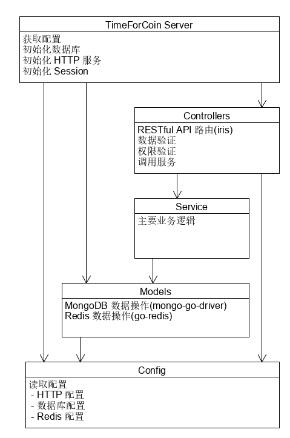

# 架构设计

## 技术选型

服务端：Golang

路由框架：[iris](https://github.com/kataras/iris)

数据库：MongoDB (驱动：[mongo-go-driver](https://github.com/mongodb/mongo-go-driver/))

缓存：Redis( 驱动：[go-redis](https://github.com/go-redis/redis))

日志库：[zerolog](https://github.com/rs/zerolog)

API 规范：RESTful API

API 文档：Swagger

Web 端：Vue2.6 + Webpack

Ajax 请求：axios

微信小程序：wxss + wxml + js

## 逻辑架构


本应用的逻辑架构由三层模型构成：

### 表示层

- 使用微信小程序作为应用的表示层，主要服务于任务参与者，除了系统的基本功能之外，主要提供消息和通知功能，便于用户及时收到通知和信息。此外还支持一般的跑腿信息任务发布。
- 使用Web作为应用的表示层，主要服务于任务发布者，除了系统的基本功能之外，主要提供问卷任务的编辑与统计功能。

### 业务逻辑层

使用Golang作为服务端语言，构建HTTP服务器通过API请求处理业务逻辑，对从表示层过来的请求进行校验与处理，然后对数据持久层进行操作(读取/写入数据)并处理，最后返回给表示层进行数据的展示。

### 数据持久层

- 使用 MongoDB 作为数据库，存储业务数据
- 使用 Redis 作为缓存，用于持久化会话以及缓存一些需要重复访问的信息。
- 使用 腾讯云的对象存储服务(COS) 保存图片/任务附件等文件

## 代码结构

### 服务端目录结构

```bash
.
├── app # 服务
│   ├── app.go # 应用主体(初始化服务)
│   ├── controllers # 控制路由、数据校验
│   │   ├── article.go
│   │   ├── certification.go
│   │   ├── comment.go
│   │   ├── controllers.go
│   │   ├── file.go
│   │   ├── message.go
│   │   ├── questionnaire.go
│   │   ├── session.go
│   │   ├── task.go
│   │   └── user.go
│   ├── libs # 基本库
│   │   ├── config.go # 应用配置
│   │   ├── cos.go # 云对象存储
│   │   ├── email.go # 邮件服务
│   │   ├── error.go # 错误处理
│   │   ├── json.go
│   │   ├── utils.go
│   │   ├── verify.go # 数据校验
│   │   ├── violet.go # OAuth2 授权
│   │   └── wechat.go # 微信 授权
│   ├── models # 数据操作以及测试
│   │   ├── article.go
│   │   ├── cache.go
│   │   ├── cache_test.go
│   │   ├── comment.go
│   │   ├── comment_test.go
│   │   ├── file.go
│   │   ├── file_test.go
│   │   ├── flow.go
│   │   ├── log.go
│   │   ├── message.go
│   │   ├── message_test.go
│   │   ├── mongo.go
│   │   ├── mongo_test.go
│   │   ├── questionnaire.go
│   │   ├── redis.go
│   │   ├── redis_test.go
│   │   ├── set.go
│   │   ├── set_test.go
│   │   ├── statistics.go
│   │   ├── system.go
│   │   ├── system_test.go
│   │   ├── task.go
│   │   ├── task_status.go
│   │   ├── task_test.go
│   │   ├── user.go
│   │   └── user_test.go
│   └── services # 业务逻辑
│       ├── article.go
│       ├── comment.go
│       ├── file.go
│       ├── message.go
│       ├── questionnaire.go
│       ├── service.go
│       ├── task.go
│       └── user.go
├── config.yaml # 程序配置
├── docker-compose.yml # 容器编排
├── dockerfile # 容器部署
├── env.ps1 # 测试环境变量
├── go.mod # Golang 库管理
├── go.sum
├── main.go # 程序入口
└── test.ps1
```

### 服务端代码结构

其中`Controllers`, `Service`, `Models`再按照不同的业务划分为不同的模块



### Web端

```bash
.
├── babel.config.js
├── package-lock.json
├── package.json
├── public
│   ├── favicon.ico
│   └── index.html
├── src # 页面代码
│   ├── App.vue # 页面入口
│   ├── assets # 素材
│   │   ├── HomePage
│   │   │   ├── errand.png
│   │   │   ├── notice.png
│   │   │   ├── page1-background.jpg
│   │   │   └── questionnaire.png
│   │   ├── MissionPage
│   │   │   ├── head.jpg
│   │   │   └── test.jpg
│   │   ├── logo.png
│   │   └── logo_vue.png
│   ├── components # 组件
│   │   ├── Discover
│   │   │   ├── MissionBlock.vue
│   │   │   └── MissionCardLong.vue
│   │   ├── HomePage
│   │   │   ├── Banner.vue
│   │   │   └── DisplayPage1.vue
│   │   ├── Mission
│   │   │   ├── CreateMission
│   │   │   │   ├── FileUploader.vue
│   │   │   │   ├── ImgUploader.vue
│   │   │   │   └── TagBlock.vue
│   │   │   ├── MissionCard.vue
│   │   │   └── MissionDetail
│   │   │       ├── FileList.vue
│   │   │       ├── ImgList.vue
│   │   │       └── PlayerList.vue
│   │   ├── NavBar.vue
│   │   ├── Presentation
│   │   │   ├── Choice.vue
│   │   │   ├── Fill.vue
│   │   │   └── Score.vue
│   │   └── Question
│   │       ├── Choice.vue
│   │       ├── Fill.vue
│   │       └── Score.vue
│   ├── main.js # 程序入口
│   ├── plugins # 插件
│   │   ├── ant-design-vue.js
│   │   └── axios.js
│   ├── router.js # 路由
│   ├── services # API 服务
│   │   ├── modules
│   │   │   ├── file.js
│   │   │   ├── questionnaire.js
│   │   │   ├── task.js
│   │   │   └── user.js
│   │   └── service.js
│   ├── store # Vuex 存储
│   │   ├── modules
│   │   │   └── user.js
│   │   └── store.js
│   ├── utils # 工具
│   │   ├── modules
│   │   │   └── verify.js
│   │   └── utils.js
│   └── views # 视图页面
│       ├── About.vue
│       ├── Discover.vue
│       ├── Home.vue
│       ├── Mission.vue
│       ├── MissionCenter
│       │   ├── MissionInformation.vue
│       │   └── MissionTypeChoice.vue
│       ├── MissionDetail.vue
│       ├── Presentation.vue
│       ├── Questionnaire.vue
│       └── User.vue
├── violet.config.js
└── vue.config.js
```

### 微信小程序

```bash
.
├── README.md
├── app.js # 程序入口
├── app.json
├── app.wxss
├── images # 图片资源
│   └── ...
├── miniprogram_npm
│   └── moment
│       └── ...
├── package-lock.json
├── package.json
├── pages # 页面
│   ├── AddItem
│   │   ├── AddItem.js
│   │   ├── AddItem.json
│   │   ├── AddItem.wxml
│   │   └── AddItem.wxss
│   ├── AddedItems
│   │   ├── AddedItems.js
│   │   ├── AddedItems.json
│   │   ├── AddedItems.wxml
│   │   └── AddedItems.wxss
│   ├── CollectList
│   │   ├── CollectList.js
│   │   ├── CollectList.json
│   │   ├── CollectList.wxml
│   │   └── CollectList.wxss
│   ├── Comment
│   │   ├── Comment.js
│   │   ├── Comment.json
│   │   ├── Comment.wxml
│   │   └── Comment.wxss
│   ├── Detail
│   │   ├── Detail.js
│   │   ├── Detail.json
│   │   ├── Detail.wxml
│   │   └── Detail.wxss
│   ├── Message
│   │   ├── Message.js
│   │   ├── Message.json
│   │   ├── Message.wxml
│   │   └── Message.wxss
│   ├── MessageDetail
│   │   ├── MessageDetail.js
│   │   ├── MessageDetail.json
│   │   ├── MessageDetail.wxml
│   │   └── MessageDetail.wxss
│   ├── ParticipateTask
│   │   ├── ParticipateTask.js
│   │   ├── ParticipateTask.json
│   │   ├── ParticipateTask.wxml
│   │   └── ParticipateTask.wxss
│   ├── Questionnaire
│   │   ├── Questionnaire.js
│   │   ├── Questionnaire.json
│   │   ├── Questionnaire.wxml
│   │   └── Questionnaire.wxss
│   ├── SearchResult
│   │   ├── SearchResult.js
│   │   ├── SearchResult.json
│   │   ├── SearchResult.wxml
│   │   └── SearchResult.wxss
│   ├── index
│   │   ├── index.js
│   │   ├── index.json
│   │   ├── index.wxml
│   │   └── index.wxss
│   └── userInfo
│       ├── userInfo.js
│       ├── userInfo.json
│       ├── userInfo.wxml
│       └── userInfo.wxss
├── project.config.json
├── services # 请求封装
│   └── server.js
├── sitemap.json
└── utils # 通用工具方法
    └── util.js

```


## ECB 关系

- Entity：代表系统数据，如：用户、任务、问卷等
- Boundary：与用户的接口，如：UI界面、网关、代理等
- Controller：连接 Boundary 和 Entity 的媒介，编排来自 Boundary 的命令的执行

### Entity

- 在[API文档](http://xm.zhenly.cn//docs/swagger/?url=https://raw.githubusercontent.com/TimeForCoin/Dashboard/master/design/api.yaml#/)的底部定义了应用表示层可以获得的所有实体数据结构
- 在服务端的`Model`层定义了数据持久层所存储的所有的实体数据结构

### Boundary

- 通过微信小程序提供用户界面
- 通过 Web 页面提供用户界面
- 通过 Nginx 反向代理提供静态页面文件和API请求转发

### Controller

- 在服务端的`Controller`层中接受来自 Boundary 的命令，校验请求的合法性然后调用 `Service` 层中的指令进行业务逻辑的执行。
- 在服务端的`Service`层中接受来自 `Controller` 层的指令，根据其传入的合法参数和业务逻辑调用`Model`层对数据进行查询或更新。
