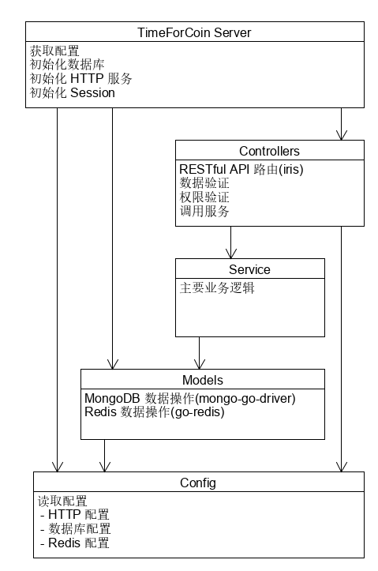

# TimeForCoin 后端

## 技术选型

后端：Golang

路由框架：[iris](https://github.com/kataras/iris)

数据库：MongoDB

数据库驱动：[mongo-go-driver](https://github.com/mongodb/mongo-go-driver/)

缓存：Redis

缓存驱动：[go-redis](https://github.com/go-redis/redis)

日志库：[zerolog](https://github.com/rs/zerolog)

API 规范：RESTful API

API 文档：Swagger

## 架构设计

图中箭头为依赖关系

其中`Controllers`, `Service`, `Models`再按照不同的业务划分为不同的模块

## 数据库设计

暂无

## API 设计

暂无
