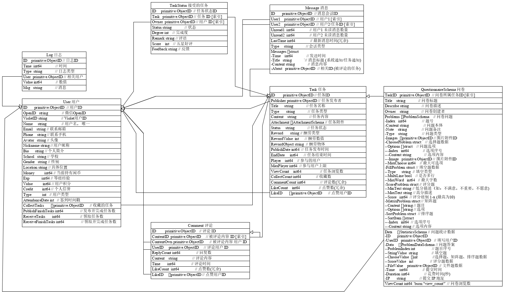

# 数据库设计文档

| 版本 | 修订人     | 修订日期   |
| ---- | ---------- | ---------- |
| 1.0  | ZhenlyChen | 2019-04-13 |

## 基本数据库划分

根据[MongoDB 的模式设计的六大经验原则](https://www.mongodb.com/blog/post/6-rules-of-thumb-for-mongodb-schema-design-part-1)

对于**嵌入对象和引用的选择**，应考虑：

- Embed the N side if the cardinality is one-to-few and there is no need to access the embedded object outside the context of the parent object

如果是一对少数，并且不需要单独访问的对象，则嵌入对象

- Use an array of references to the N-side objects if the cardinality is one-to-many or if the N-side objects should stand alone for any reasons

如果是一对多数，或者如果对象因为任何原因应该单独存在，则使用引用数组

- Use a reference to the One-side in the N-side objects if the cardinality is one-to-squillions

如果是单方面对于多方面，则使用引用

**非规范化**允许您避免某些应用程序级别的连接，但代价是要进行更复杂和昂贵的更新，对于是否进行`denormalize`，应考虑：

- You cannot perform an atomic update on denormalized data

  不能对非规范化数据执行原子更新

- Denormalization only makes sense when you have a high read to write ratio

  只有当读写比率较高时，非规范化才有意义

总结一下，就是：

- **One:** favor embedding unless there is a compelling reason not to

  除非有令人信服的理由，否则使用**嵌入**

- **Two:** needing to access an object on its own is a compelling reason not to embed it

  如果需要**单独访问对象**，则不使用嵌入

- **Three:** Arrays should not grow without bound. If there are more than a couple of hundred documents on the “many” side, don’t embed them; if there are more than a few thousand documents on the “many” side, don’t use an array of ObjectID references. High-cardinality arrays are a compelling reason not to embed.

  **数组不应该无限制地增长**

  如果在"多"方面有几百个以上的文档，不要嵌入它们

  如果在"多"方面有几千个以上的文档，不要使用一个 ObjectID 引用数组

  如果数组长度过多，则不使用嵌入

- **Four:** Don’t be afraid of application-level joins: if you index correctly and use the projection specifier then application-level joins are barely more expensive than server-side joins in a relational database.

  **不要害怕应用程序级别的连接**

  如果正确地索引并使用投影说明符，那么应用程序级别的连接几乎不会比服务器端连接关系数据库更昂贵

- **Five:** Consider the write/read ratio when denormalizing. A field that will mostly be read and only seldom updated is a good candidate for denormalization: if you denormalize a field that is updated frequently then the extra work of finding and updating all the instances is likely to overwhelm the savings that you get from denormalizing.

  **考虑非规范化时的写 / 读比率**

  一个大多数时候会被读取但很少更新的字段是非规范化的好候选者: 如果你对一个频繁更新的字段进行非规范化，那么查找和更新所有实例的额外工作很可能会超过你从非规范化中节省的

- **Six:** As always with MongoDB, how you model your data depends – entirely – on your particular application’s data access patterns. You want to structure your data to match the ways that your application queries and updates it.

  在 MongoDB 中，如何对数据建模完全**取决于特定应用程序的数据访问模式**

  需要使数据的结构与应用程序查询和更新数据的方式相匹配

结合以上的经验，根据`TimeForCoin`的需求，目前数据库的数据分为**7 个部分**：

### 用户数据

- 用户基本信息
- 用户个性信息(昵称、头像、联系方式等)
- 用户数据(钱包、积分等)
- 其他相关数据 (完成任务数、发布任务数、未读通知数等)

对于一个 Web 应用，用户系统是不可或缺的部分。

对于用户昵称，头像等经常需要批量获取（比如在评论列表中）的数据，这里会使用 Redis 对其进行缓存。

这里其他相关的数据都属于反范式的冗余数据，但是考虑到这些数据读取次数远大于写入次数，写读比率很低，因此使用冗余数据可以很好提高读取效率，而不需要每次都查看相关数据的数组长度。

### 任务数据

- 任务的基本信息(名称、类型、酬劳、时间等)
- 任务扩展信息(浏览数、收藏数、点赞数、图片、附件等)
- 参与的用户数

任务系统是本项目中的核心。

这个部分专门存储任务的各种信息，还有任务的评论。

而图片附件之类，是任务一对多的对象，和任务有强烈的关联性，数量也不会很多，因此也一同作为嵌入对象存储。

而参与的用户数为反范式的冗余数据，因为这个数据的写读比比较低，使用反范式的设计，可以极大提高了读取的效率。否则每次读取都需要对下面的整个集合做一次查询

### 接受的任务

- 用户与任务的状态
  - 任务 ID、用户 ID
  - 状态：已完成、进行中、已放弃等
  - 数据：评价，完成度，反馈等信息

根据需求，不仅需要获取任务信息流，还需要获取不同用户发布和接受的任务。

每个用户对于不同的任务也存在一些状态数据，比如完成、放弃、失败等状态，

由于我们需要根据某个用户获取其指定的任务列表，因此这里没有将这些数据一同放在任务数据中，而是存放在每个用户的数据对象当中，可以极大提高查询效率。

由于我们需要对这些任务状态进行管理和分类，并且也有读取某一任务所有参与用户的需求，再者考虑到这些数据存在无限增长的可能，因此这里把这些数据单独提取出来作为一个集合，而不是与用户数据存放在一起。

### 评论数据

- 所属任务(索引)

- 评论基本内容

- 评论数据(点赞数、点赞的用户 ID)

评论数据为任务提供评论数据

评论信息使用了单独的对象而不是嵌入到任务对象中，这是因为考虑到评论数据是一个增长并且频繁变动的数组，并且具有分页的需求，很明显引用数组是不适合的，如果作为内嵌对象数组的话排序和分页也是一个很大的问题。因此这里把评论单独抽离出来，可以更加灵活地查询评论数据。

这里把点赞数和点赞用户 ID 放在一起是为了点赞操作的原子性，而点赞数的冗余是为了减少数据的传输而提高查询的效率，因为点赞的用户 ID 是一个通常比较长的数组，对于整个数据对象来说都是十分大的，查询的时候可以通过选取指定的数据，不返回 ID 列表。换句话说，这个 ID 列表是不出现与服务端和前端的，服务端和前端得到的数据只有点赞数以及当前用户是否点赞，点赞的查询和防止重复完全可以交给数据库操作。

### 问卷系统

- 问卷题目
  - 类型
  - 具体数据
- 问卷数据
  - 每个用户的所选选项

因为问卷题目和统计数据都是依附于问卷的，因此以一个问卷为一个对象进行存储，分别存储问卷的题目和数据。

虽然我们也有获取所有数据选项有多少人选的需求，但是这个需求不大，仅仅发布者具有这个需求，而填写数据的需求往往比这个多很多，如果添加反范式的冗余数据，那么写读比就会很高，完全违背了反范式的目的。

### 消息系统

- 用户之间私密沟通
- 任务通知
- 系统通知

任务发布者和接收者的沟通是非常必要的，尤其对于一些跑腿任务，需要任务执行者实时于发布者沟通。

基于统一性，任务通知和系统通知以消息的形式和用户消息一同存储，因为他们都有相同的功能和结构。

因为消息数据是一组可以快速增长数据，因为每个会话都会被划分成一个对象，并且以用户 ID 作为辅助索引，避免单一对象过大导致 MongoDB 的性能问题。

单个会话也可能因为消息过多形成过大的对象，但这只是极个别现象，一般都不会造成太大的性能问题。

考虑到一般只需要获取最近的前几条消息，而久远的信息一般都不会读取，因此可以考虑信息数量超过一定的阈值之后删除某个时间之前的所有消息。

### 日志系统

- 重要操作
- 数据埋点
- 数据更改

记录导致用户数据变化的事件，用于分析以及维护系统安全

数据埋点主要用于应用运营分析以及生成用户画像等

## 数据库具体设计

### 用户数据库

```go
// UserGender 用户性别
const (
    GenderMan   UserGender = "man"   // 男
    GenderWoman UserGender = "woman" // 女
    GenderOther UserGender = "other" // 其他
)

// UserType 用户类型
const (
    UserTypeBan    UserType = "ban"    // 禁封用户
    UserTypeNormal UserType = "normal" // 正式用户
    UserTypeAdmin  UserType = "admin"  // 管理员
    UserTypeRoot   UserType = "root"   // 超级管理员
)

type UserInfoSchema struct {
    Email    string     // 联系邮箱
    Phone    string     // 联系手机
    Avatar   string     // 头像
    Nickname string     // 用户昵称
    Bio      string     // 个人简介
    School   string     // 学校
    Gender   UserGender // 性别
    Location string     // 具体位置
}

type UserDataSchema struct {
    Money          int64                // 当前持有闲币
    Exp            int64                // 等级经验
    Value          int64                // 用户积分
    Credit         int64                // 个人信誉
    Type           UserType             // 用户类型
    AttendanceDate int                  // 签到时间戳
    CollectTasks   []primitive.ObjectID `bson:"collect_tasks"` // 收藏的任务
    // 冗余数据
    PublishCount    int64 `bson:"publish_count"`     // 发布任务数
    PublishRunCount int64 `bson:"publish_run_count"` // 发布并进行中任务数
    ReceiveCount    int64 `bson:"receive_count"`     // 领取任务数
    ReceiveRunCount int64 `bson:"receive_run_count"` // 领取并进行中任务数
}

// UserSchema User 基本数据结构
type UserSchema struct {
    ID           primitive.ObjectID `bson:"_id,omitempty"` // 用户ID [索引]
    OpenID       string             `bson:"open_id"`       // 微信OpenID
    VioletID     string             `bson:"violet_id"`     // VioletID
    Name         string             `bson:"name"`          // 用户名， 唯一
    RegisterTime int64              `bson:"register_time"` // 用户注册时间
    Info         UserInfoSchema     `bson:"info"`          // 用户个性信息
    Data         UserDataSchema     `bson:"data"`          // 用户数据
}
```

### 任务数据库

```go
// TaskType 任务类型
const (
    TaskTypeRunning       TaskType = "run"           // 跑腿任务
    TaskTypeQuestionnaire TaskType = "questionnaire" // 问卷任务
    TaskTypeInfo          TaskType = "info"          // 信息任务
)

// RewardType 酬劳类型
const (
    RewardMoney    RewardType = "money"     // 闲钱币酬劳
    RewardRMB      RewardType = "rmb"       // 人民币酬劳
    RewardPhysical RewardType = "physical " // 实物酬劳
)

// TaskStatus 任务状态
const (
    TaskStatusDraft   TaskStatus = "draft"   // 草稿
    TaskStatusWait    TaskStatus = "wait"    // 等待接受
    TaskStatusRun     TaskStatus = "run"     // 执行中（人数已满）
    TaskStatusClose   TaskStatus = "close"   // 已关闭
    TaskStatusFinish  TaskStatus = "finish"  // 已完成
    TaskStatusOverdue TaskStatus = "overdue" // 已过期
)

// AttachType 附件类型
const (
    AttachImage AttachType = "image" // 图片
    AttachFile  AttachType = "file"  // 文件
)

// AttachmentSchema 附件数据结构
// 附件存储在本地文件系统中 ./{任务ID}/{附件ID}
type AttachmentSchema struct {
    ID          primitive.ObjectID // 附件ID
    Type        AttachType         // 附件类型
    Name        string             // 附件名
    Description string             // 附件描述
    Size        int64              // 附件大小
    Time        int64              // 创建时间
    Use         bool               // 是否使用，未使用附件将定期处理
    Public      bool               // 公开
}

// TaskSchema Task 基本数据结构
type TaskSchema struct {
    ID        primitive.ObjectID `bson:"_id,omitempty"` // 任务ID
    Publisher primitive.ObjectID `bson:"publisher"`     // 任务发布者 [索引]

    Title          string             // 任务名称
    Type           TaskType           // 任务类型
    Content        string             // 任务内容
    Attachment     []AttachmentSchema // 任务附件
    UserAttachment []AttachmentSchema // 用户上传附件
    Status         TaskStatus         // 任务状态

    Reward       RewardType // 酬劳类型
    RewardValue  float32    `bson:"reward_value, omitempty"`  // 酬劳数值
    RewardObject string     `bson:"reward_object, omitempty"` // 酬劳物体

    PublishDate int64 `bson:"publish_date"` // 任务发布时间
    StartDate   int64 `bson:"start_date"`   // 任务开始时间
    EndDate     int64 `bson:"end_data"`     // 任务结束时间

    PlayerCount int64 `bson:"player_count"` // 参与的用户
    MaxPlayer   int64 `bson:"max_player"`   // 参与用户上限, -1为无限制
    MaxFinsih   int64 `bson:"max_finish"`   // 完成用户上限, 可用于收集指定数量问卷
    AutoAccept  bool  `bson:"auto_accept"`  // 自动同意领取任务

    ViewCount    int64                `bson:"view_count"`    // 任务浏览数
    CollectCount int64                `bson:"collect_count"` // 收藏数
    CommentCount int64                `bson:"comment_count"` // 评论数(冗余)
    LikeCount    int64                `bson:"like_count"`    // 点赞数(冗余)
    LikeID       []primitive.ObjectID `bson:"like_id"`       // 点赞用户ID
}
```

### 接受任务数据库

```go
// PlayerStatus 参与用户状态
const (
    PlayerClose   PlayerStatus = "close"   // 发布者关闭任务
    PlayerRunning PlayerStatus = "running" // 用户进行中
    PlayerFinish  PlayerStatus = "finish"  // 用户已完成
    PlayerGiveUp  PlayerStatus = "give_up" // 用户已放弃
    PlayerFailure PlayerStatus = "failure" // 任务失败
)

// TaskStatusSchema 接受的任务状态 基本数据结构
// bson 默认为名字小写
type TaskStatusSchema struct {
    ID     primitive.ObjectID `bson:"_id,omitempty"` // 任务状态ID
    Task   primitive.ObjectID `bson:"task"`          // 任务 ID [索引]
    Owner  primitive.ObjectID `bson:"owner"`         // 用户 ID [索引]
    Status PlayerStatus       // 状态
    Note   string             // 申请备注
    Accept bool               // 是否同意加入
    // 完成后的评价
    Degree int    // 完成度
    Remark string // 评语
    // 用户的反馈
    Score    int    // 五星好评
    Feedback string // 反馈
}
```

### 评论数据库

```go
// CommentSchema 评论数据结构
type CommentSchema struct {
    ID         primitive.ObjectID   `bson:"_id,omitempty"` // 评论 ID
    ContentID  primitive.ObjectID   `bson:"content_id"`    // 被评论内容 ID [索引]
    ContentOwn primitive.ObjectID   `bson:"content_own"`   // 被评论内容 用户 ID (冗余)
    UserID     primitive.ObjectID   `bson:"user_id"`       // 评论用户 ID
    ReplyCount int64                `bson:"reply_count"`   // 回复数
    LikeCount  int64                `bson:"like_count"`    // 点赞数(冗余)
    LikeID     []primitive.ObjectID `bson:"like_id"`       // 点赞用户ID
    Content    string               `bson:"content"`       // 评论内容
    Time       int64                `bson:"time"`          // 评论时间
}
```

### 问卷数据库

```go
// ProblemType 问题类型
const (
    ProblemNone   ProblemType = "none"   // 纯文字描述
    ProblemChoose ProblemType = "choose" // 选择题
    ProblemMatrix ProblemType = "matrix" // 矩阵题
    ProblemFill   ProblemType = "fill"   // 填空题
    ProblemScore  ProblemType = "score"  // 评分题
    ProblemSort   ProblemType = "sort"   // 排序题
)

// Fill 填空类型
const (
    FillPhone  FillType = "phone"  // 手机号码
    FillNumber FillType = "number" // 数字
    FillDate   FillType = "date"   // 日期
    FillEmail  FillType = "email"  // 电子邮箱
    FillID     FillType = "id"     // 身份证
    FillWeb    FillType = "web"    // 网址
    FillFile   FillType = "file"   // 文件(用于资料征集)
    FillAll    FillType = "all"    // 不限类型
)

// ProblemSchema 问卷问题
type ProblemSchema struct {
    Index   int64                // 题号
    Content string               // 问题本体
    Note    string               // 问题备注
    Type    ProblemType          // 问题类型
    Images  []primitive.ObjectID // 图片附件ID

    // 选择题数据
    ChooseProblem struct {
        Options []struct {
            Index   int64              // 选项序号
            Content string             // 选项内容
            Image   primitive.ObjectID `bson:"image,omitempty"` // 图片附件ID
        } `bson:"options"` // 问题选项
        MaxChoose int64 `bson:"max_choose"` // 最大可选项
    } `bson:"choose_problem,omitempty"`

    // 填空题数据
    FillProblem struct {
        Type      FillType `bson:"type"`                  // 填空类型
        MultiLine bool     `bson:"multi_line, omitempty"` // 是否多行
        MaxWord   int64    `bson:"max_word, omitempty"`   // 最大字数
    } `bson:"fill_problem, omitempty"`

    // 评分题
    ScoreProblem struct {
        MinText string `bson:"min_text"` // 低分描述（如：不满意，不重要，不愿意)
        MaxText string `bson:"max_text"` // 高分描述
        Score   int64  `bson:"score"`    // 评分级别 1-x (最高为10)
    } `bson:"score_problem, omitempty"`

    // 矩阵题
    MatrixProblem struct {
        Content []string // 题目
        Options []string // 选项
    } `bson:"matrix_problem, omitempty"`

    // 排序题
    SortProblem struct {
        SortItem []struct {
            Index   int64  // 选项序号
            Content string // 选项内容
        } `bson:"sort_item"`
    } `bson:"sort_problem, omitempty"`
}

// StatisticsSchema 用户填写数据
type StatisticsSchema struct {
    UserID   primitive.ObjectID  `bson:"user_id"` // 填写用户ID
    Data     []ProblemDataSchema // 问题答案
    Time     int64               // 提交时间
    Duration int64               // 花费时间(秒)
    IP       string              // 提交 IP 地址
}

// ProblemDataSchema 问题数据
type ProblemDataSchema struct {
    ProblemIndex int                `bson:"problem_index"`           // 题目序号
    StringValue  string             `bson:"string_value, omitempty"` // 填空题
    ChooseValue  []int              `bson:"choose_value, omitempty"` // 选择题、矩阵题、排序题数据
    ScoreValue   int                `bson:"score_value, omitempty"`  // 评分题数据
    FileValue    primitive.ObjectID `bson:"file_value, omitempty"`   // 文件题数据
}

// QuestionnaireSchema 问卷数据结构
type QuestionnaireSchema struct {
    TaskID    primitive.ObjectID `bson:"_id"`        // 问卷所属任务ID [索引]

    Title       string             // 问卷标题
    Description string             // 问卷描述
    Owner       string             // 问卷创建者(冗余)
    Anonymous   bool               // 匿名收集
    Problems    []ProblemSchema    // 问卷问题
    Data        []StatisticsSchema // 问题统计数据
}
```

### 消息数据库

```go
// MessageType 消息类型
const (
    MessageTypeChat    MessageType = "chat"    // 聊天
    MessageTypeSystem  MessageType = "system"  // 系统通知
    MessageTypeTask    MessageType = "task"    // 任务通知
    MessageTypeComment MessageType = "comment" // 评论通知
)

// MessageSchema Message 数据结构
// bson 默认为名字小写
type MessageSchema struct {
    ID       primitive.ObjectID `bson:"_id,omitempty"` // 消息会话ID
    User1    primitive.ObjectID `bson:"user_1"`        // 用户1 [索引]
    User2    primitive.ObjectID `bson:"user_2"`        // 用户2/任务ID [索引]
    Unread1  int64              `bson:"unread_1"`      // 用户1 未读消息数量
    Unread2  int64              `bson:"unread_2"`      // 用户2 未读消息数量
    LastTime int64              `bson:"last_time"`     // 最新消息时间(冗余)
    Type     MessageType        `bson:"type"`          // 会话类型
    Messages []struct {
        Time    int64              `bson:"time"`             // 发送时间
        Title   string             `bson:"title, omitempty"` // 消息标题 (系统通知/任务通知)
        Content string             `bson:"content"`          // 消息内容
        About   primitive.ObjectID `bson:"about, omitempty"` // 相关ID (被评论的任务)
    }
}
```

### 日志数据库

```go
// LogType 日志类型
const (
    LogTypeMoney  LogType = "user_money"   // 金钱变动
    LogTypeValue  LogType = "user_value"   // 用户积分变动
    LogTypeCredit LogType = "user_credit"  // 信用变动
    LogTypeLogin  LogType = "user_login"   // 用户登陆
    LogTypeClear  LogType = "system_clear" // 系统清理
    LogTypeStart  LogType = "system_start" // 系统启动
    LogTypeError  LogType = "system_error" // 系统运行时错误
)

// LogSchema 日志数据结构
type LogSchema struct {
    ID    primitive.ObjectID `bson:"_id,omitempty"` // 日志ID
    Time  int64              // 时间
    Type  LogType            // 日志类型
    User  primitive.ObjectID `bson:"user,omitempty"`  // 相关用户
    About primitive.ObjectID `bson:"about,omitempty"` // 相关事件
    Value int64              `bson:"value,omitempty"` // 数值
    Msg   string             `bson:"msg,omitempty"`   // 消息
}
```

### 数据库关系图


