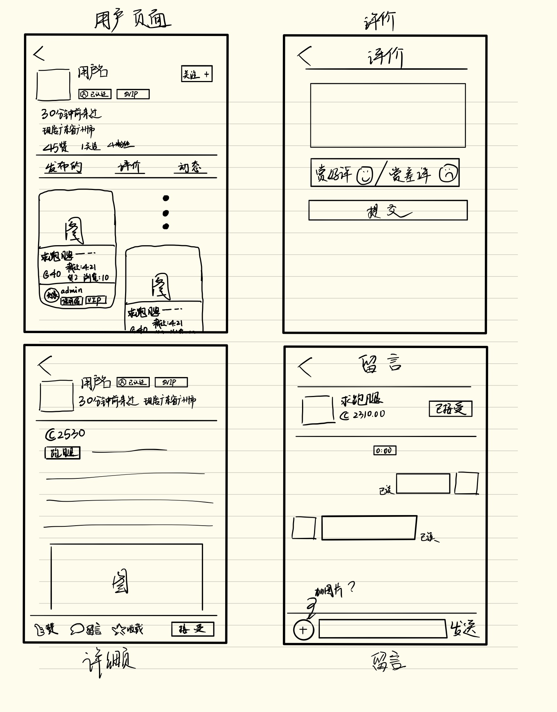

# UI设计

## Client

Web端的UI使用Adobe Experience Design来设计，其设计图位于`design/ui-design/web.xd`。

**该设计为最初版本的Web UI设计图，最终成果将根据开发进度、用户体验、需求进行调整。**

**如果需要查看不同场景之间的关联，请使用Adobe XD查看设计图。**

## Mini Program

小程序端的UI使用绘图工具来设计，其绘制图如下。

**该设计为最初版本的小程序UI设计图，最终成果将根据开发进度、用户体验、需求进行调整。**

