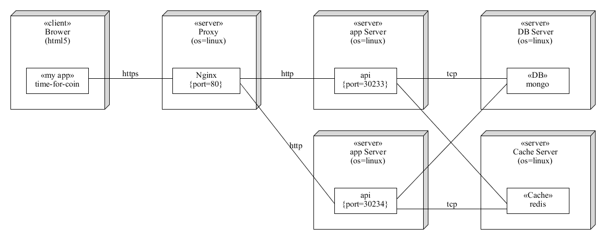

# 部署说明

## 应用部署架构



## 前端部署

生成静态文件

```bash
npm run build
```

复制到服务器指定目录

使用Nginx进行代理

```conf
server {
  listen 443 ssl http2;
  server_name coin.zhenly.cn;
  
  ssl on;
	# ...
	# SSL 配置

  add_header Strict-Transport-Security "max-age=63072000; includeSubdomains; preload" always;
  add_header X-Frame-Options SAMEORIGIN always;
  add_header X-XSS-Protection "1; mode=block" always;
  add_header X-Content-Type-Options nosniff;

  location / {
    root   /root/TimeForCoin/Web;
    index  index.html index.htm;
    try_files $uri $uri/ /index.html;
  }
}
```


## 小程序部署

使用**微信web开发者工具**打开工程目录，编译源码并上传，然后预览小程序或者在微信公众平台上发布应用


## 服务端部署


```config
server {
  listen 443 ssl http2;
  server_name coin.zhenly.cn;
  
  ssl on;
	# ...
	# SSL 配置

  add_header Strict-Transport-Security "max-age=63072000; includeSubdomains; preload" always;
  add_header X-Frame-Options SAMEORIGIN always;
  add_header X-XSS-Protection "1; mode=block" always;
  add_header X-Content-Type-Options nosniff;

  location /api/ {
    proxy_set_header X-Real-IP $remote_addr;
    proxy_set_header X-Forwarded-For $proxy_add_x_forwarded_for;
    proxy_set_header Host $http_host;
    proxy_set_header X-NginX-Proxy true;
    proxy_pass http://127.0.0.1:30233/;
    proxy_redirect off;
  }
 }
```

