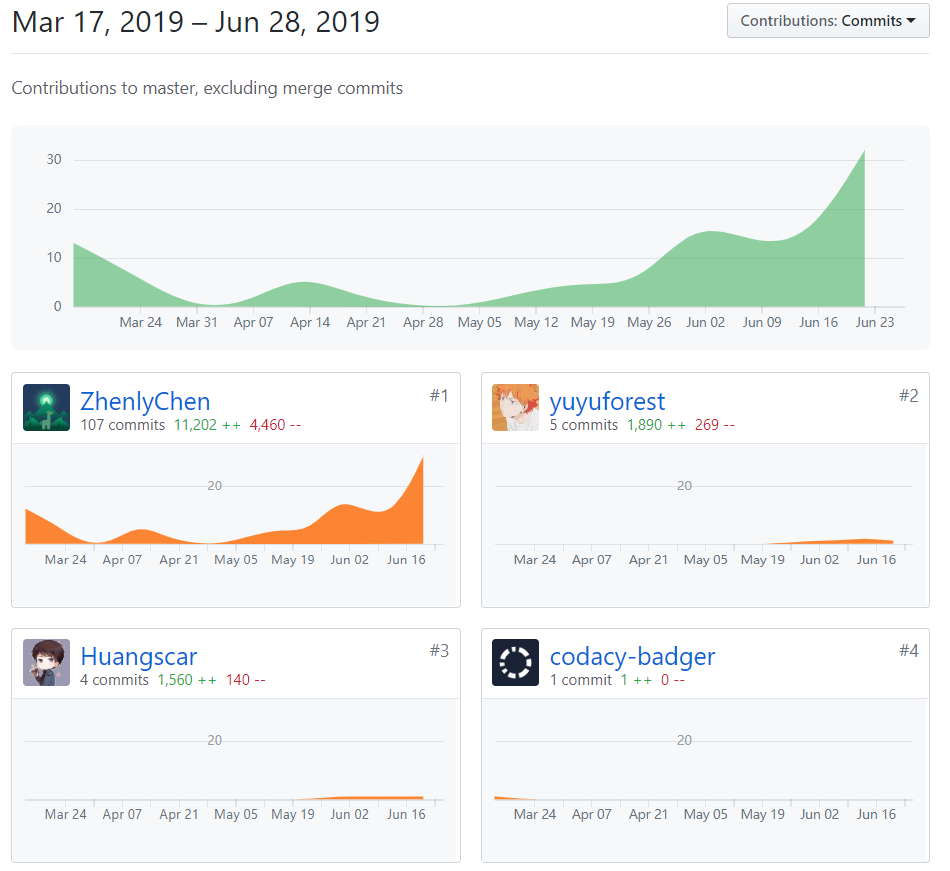

# 个人报告

15335055 Huangscar

GitHub：[Huangscar](https://github.com/Huangscar)

## 简短的课程学习自我总结

在本次项目里我担当参与后端系统设计和部分API的实现的工作

在项目前期和队友一起讨论了项目的基本信息，和后端的同学一起参与后端系统设计。后期完成部分API的实现工作。

在这个项目中我学习到了很多，例如后端框架、API设计等，这是我第一次使用 Mongodb，学到了很多相关的操作。最后，非常感谢后端负责人的带领。

## PSP2.1

|                     | Personal Software Process Stages | Time(%) |
| ------------------- | -------------------------------- | ------- |
| **Inputs Required** |                                  | **10**   |
|                     | 估计时间                         | 10       |
| **Planning**        |                                  | **5**  |
|                     | 需求分析                         | 5       |
| **Development**     |                                  | **80**  |
|                     | 设计程序                         | 5      |
|                     | 实施编码                         | 50      |
|                     | 审查代码                         | 10      |
|                     | 编译并测试程序                    | 15      |
| **Exit Criteria**   |                                  | **5**  |
|                     | 完成项目计划总结                 | 5       |

## 个人GIT总结报告

## 自认为最得意/或有价值/或有苦劳的工作清单

参与了后端系统设计和部分API的实现，按时完成了任务相关的api，同时在与各种大佬的交流下，学到了很多后端开发的知识。

## 个人的技术类、项目管理类博客清单

https://blog.csdn.net/huangscar/article/details/94027739