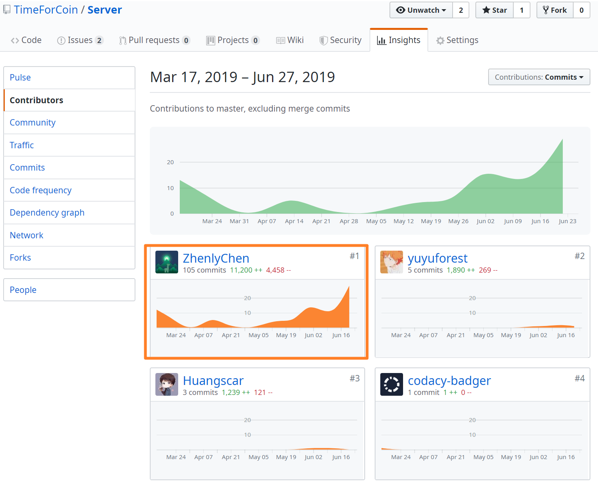
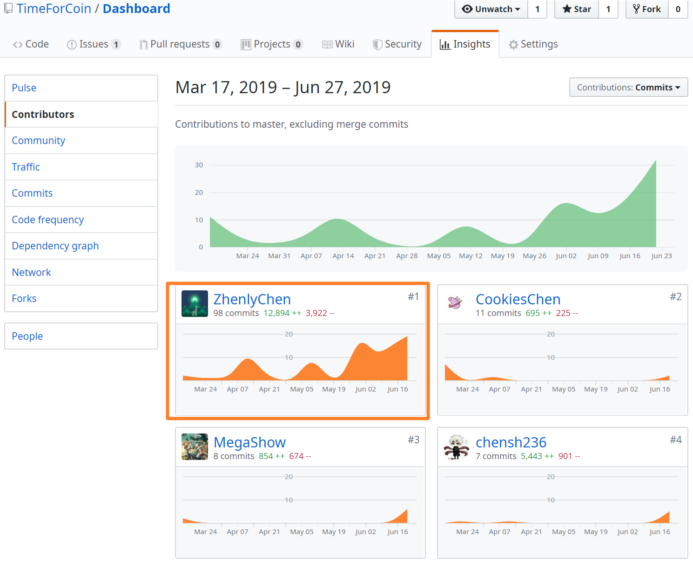
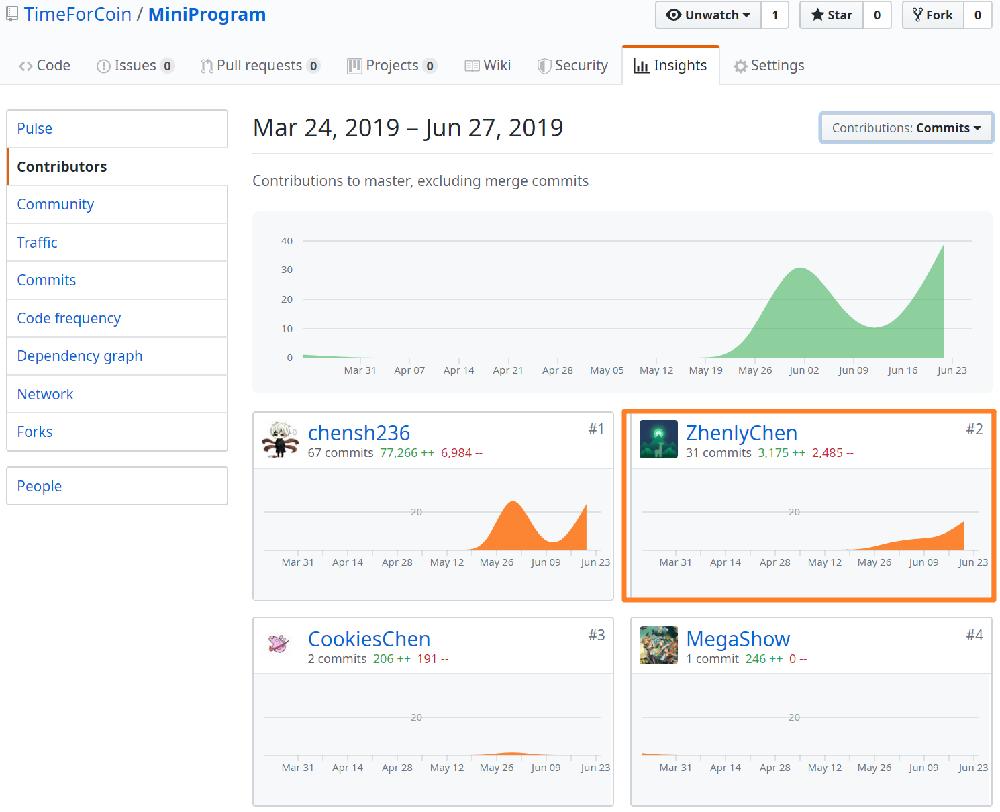
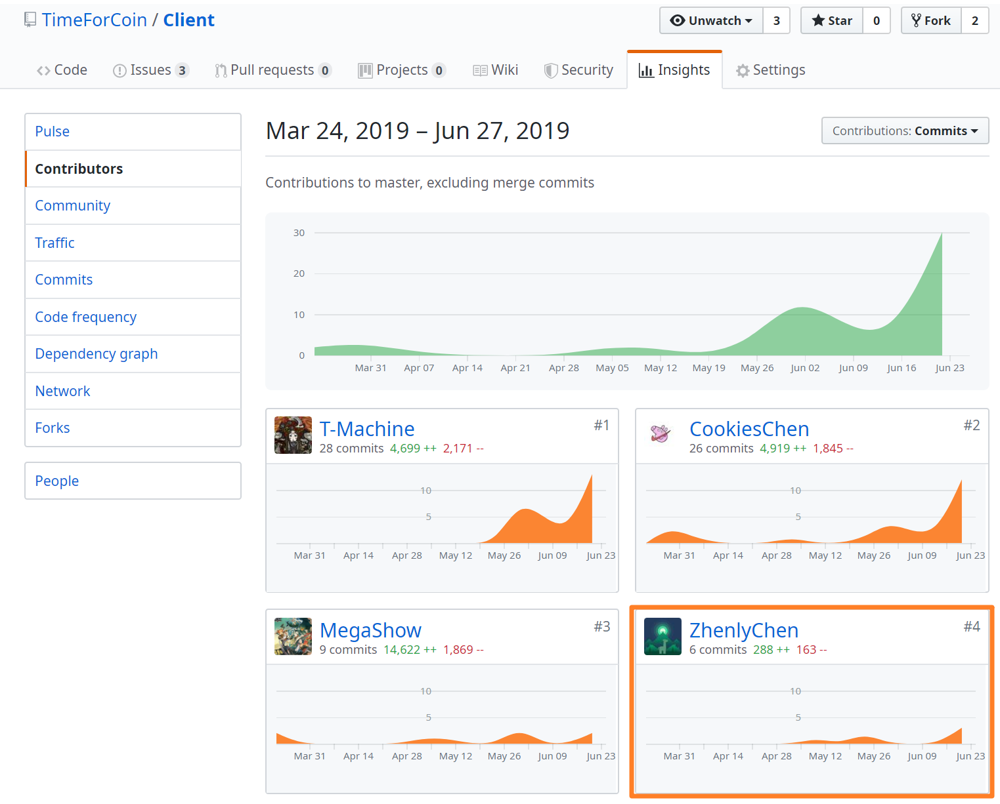

# 个人报告

Github：[ZhenlyChen](https://github.com/zhenlychen/)

## 简短的课程学习自我总结

在这个项目中我主要负责服务端的编码，也做了一部分产品和其他客户端的工作。

### 分析

在项目的一开始，我们需要分析项目的需求，我负责服务端的架构以及接口的设计，自然是需要通过分析需求形成API文档，在这个过程中分析能力是十分重要的。需要先在脑海中形成产品的雏形，然后根据不同的用例设计出API，API的参数以及返回值也需要结合用例场景进行设计，避免前端多次请求的同时又需要保持接口的可重用性，另外也需要注意接口之间的耦合程度，这些都是需要我们具体分析的。

### 设计

一个优雅并且可维护的程序必然具有良好的设计，因此设计是编码实现之前非常重要的一步。在设计服务端的时候，需要考虑到各个模块的耦合度，并且尽量提高代码的可读性，在其中有很多的学问和细节，我在这里一时半会也说不完。设计一个系统的框架需要有一定的前瞻性，个人感觉这些都是需要一定的项目经验积累的，因为设计的缺陷往往都是在项目的后期，当系统庞大起来的时候才会发现的，但这个时候系统的修改起来代价一般会很大，需要在一次又一次的重构或者开启新项目的过程中逐渐完善程序的设计。

### 管理

在这次的项目当中，我主要负责服务端的开发，也做了一部分产品和其他客户端的工作。虽然以前也开发过不少项目，但是大多数都是单人或者两个人协作完成的。而这次的项目团队有7个人，因此各个部分分工就比较明确，每个人各司其职，最终组成一个完整的项目。虽然本项目分为服务端、Web端和微信小程序三个部分，但是其开发过程并不是独立的，比如服务端开发了API经过测试后提供给前端使用，前端在使用过程中又有可能发现测试没有发现的错误，然后反过来促进服务端的开发，各个部分都是紧密相连的。

最后特别致谢本项目的队友，项目的各个部分都付出了相当多的精力，不管是整体的设计还是具体的细节上，都把项目打造得更加完美。

## PSP 2.1

|                     | Personal Software Process Stages | Time(%) |
| ------------------- | -------------------------------- | ---- |
| **Inputs Required** |                                  | **5** |
|                     | 估计时间                        | 5 |
| **Planning**        |                                  | **15** |
|                     | 制定需求文档 | 8 |
| | 制定开发计划 | 5 |
| | 制定进度模板 | 2 |
|**Development**         |                  | **60** |
|                     | 设计程序 | 15 |
| | 审查设计 | 5 |
| | 实施编码 | 25 |
| | 审查代码 | 5 |
| | 编译并测试程序 | 10 |
|    **Postmortem**      |                  | **5** |
|                     | 填写项目计划汇总表 | 5 |
|        **Exit Criteria**                |              | **15** |
|                     | 完成程序测试报告 | 6 |
| | 完成项目计划总结 | 4 |
| | 完成设计和代码审查清单 | 5       |

## 个人分支的 GIT 统计报告

### 服务端

### 文档

### 小程序

### Web端

## 自认为最得意/或有价值/或有苦劳的工作清单

### 最得意

根据之前的项目经验，通过设计中间件，利用Golang的panic和recover机制设计了一套断言机制，极大地提高了代码的可读性。（使用一句代码`Assert()`代替Golang中一大堆一大堆的`if err != nil {...}`）

### 最有价值

结合之前的项目经验，设计了更加合理和舒服的的服务端架构

### 最有劳苦

根据需求文档写了`4000+`行的API文档，考虑了各种情景、条件以及可能出现的错误

