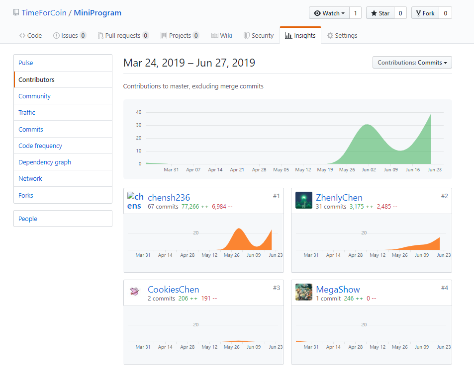
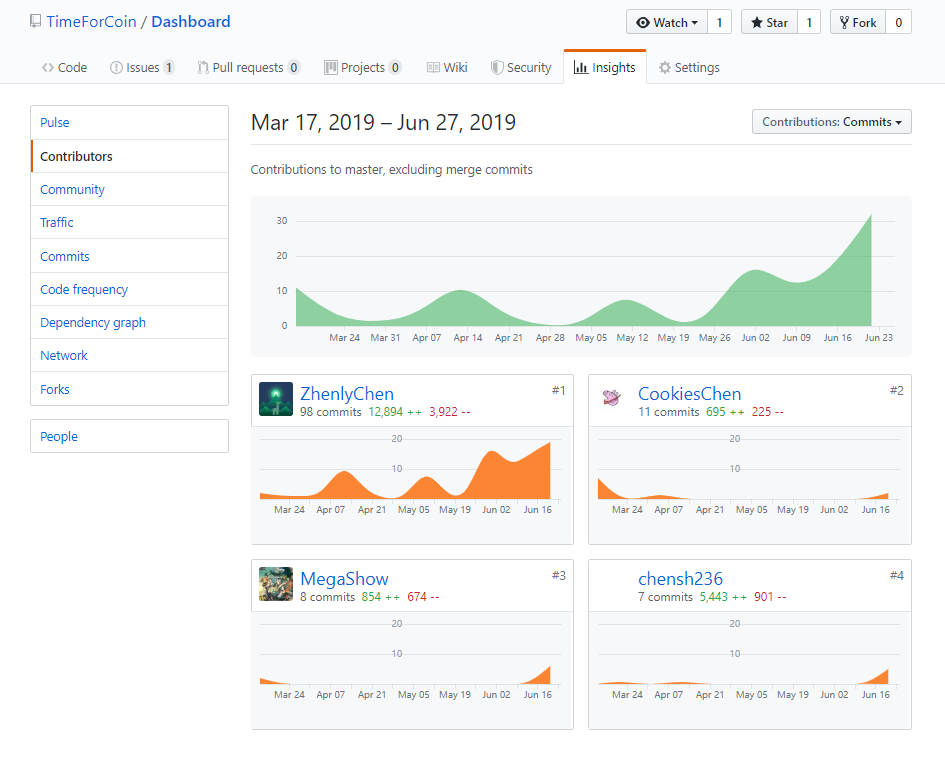

# 个人报告

## 简短的课程学习自我总结

- 该项目完成期间主要完成了SRS文档、小程序的UI设计以及大部分的实现。其中比较困难的一点在于平台功能的设计（用例设计），所以部分参考了“闲鱼”app的功能设计，并逐步完善`闲的一币`的功能。在小程序开发过程中，主要进行UI排版以及前端的逻辑交互设计，较好地完成平台小程序端的功能，包括任务相关功能、消息、个人信息功能以及评论功能等。
- 感谢`zhenly`为代表的后端实现同学的努力！

## PSP 2.1

|                     | Personal Software Process Stages | Time(%) |
| ------------------- | -------------------------------- | ---- |
| **Inputs Required** |                                  | **8** |
|                     | 估计时间                        | 5 |
| **Planning**        |                                  | **15** |
|                     | 制定需求文档 | 10 |
| | 制定开发计划 | 3 |
| | 制定进度模板 | 2 |
|**Development**         |                  | **65** |
|                     | 设计程序 | 10 |
| | 审查设计 | 5 |
| | 实施编码 | 30 |
| | 审查代码 | 10 |
| | 编译并测试程序 | 10 |
|        **Exit Criteria**                |              | **12** |
|                     | 完成程序测试报告 | 4 |
| | 完成项目计划总结 | 4 |
| | 完成设计和代码审查清单 | 4      |

## 个人分支的 GIT 统计报告

## 自认为最得意/或有价值/或有苦劳的工作清单

| 工作                 | 类型     |
| -------------------- | -------- |
| SRS文档              | 需求分析 |
| 小程序UI设计         | 程序设计 |
| 小程序大部分功能实现 | 程序设计 |
## 个人的技术类、项目管理类博客清单

[小程序实现相关博客]()
