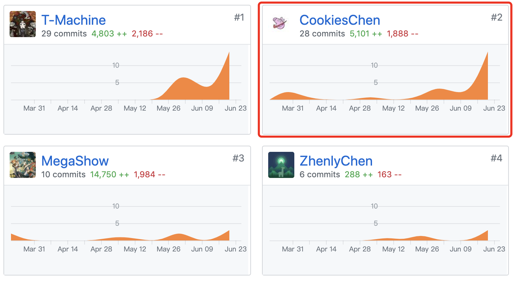
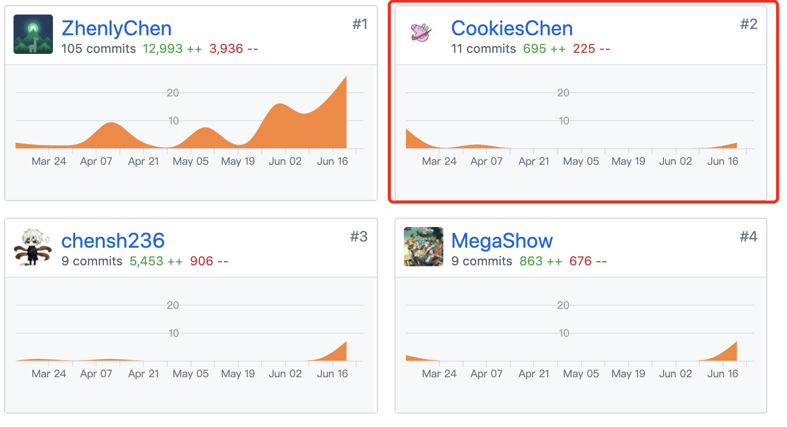

# 个人报告

16340029 CookiesChen

## 简短的课程学习自我总结

该项目完成期间主要完成了SRS文档、web端的UI设计以及部分的实现。作为前端成员，主要的工作包括编写文档、UI设计和需求分析，在付出的同时收获了非常多东西。下面分几部分介绍我这次的工作。

### 分析

* 项目前期由我先推动，设计出了最早版本的需求分析，初步分析用户需求。

### 设计

* 使用adobe xd设计了[web端UI](https://timeforcoin.github.io/Dashboard/design/ui-design.html)
* 设计[用例](https://timeforcoin.github.io/Dashboard/docs/use-case-and-activity)

### 开发

* 协同后台解决授权登录问题。
* 实现首页、发现页面、个人信息、个人预览、问卷编辑、问卷预览和问卷统计数据页面。

## PSP2.1 表格

|                                       | Personal Software Process Stages         | Time (%) |
| ------------------------------------- | ---------------------------------------- | -------- |
| **Planning**                          | **计划**                                 | **10**   |
| estimate                              | 预估任务时间                             | 10       |
| **Development**                       | **开发**                                 | 80       |
| analysis                              | 需求分析                                 | 10       |
| design spec                           | 生成设计文档                             | 5        |
| estimate                              | 设计复审（与前端团队成员审核设计文档）   | 6        |
| coding standard                       | 代码规范                                 | 2        |
| design                                | 具体设计，包括绘制 UI，设计架构等        | 15       |
| coding                                | 具体编码                                 | 22       |
| code review                           | 代码复审                                 | 5        |
| test                                  | 测试（修改代码）                         | 15       |
| **Report**                            | **报告**                                 | 10       |
| test report                           | 测试报告                                 | 1        |
| size measurement                      | 计算工作量                               | 1        |
| postmortem & process improvement plan | 每次迭代结束后写总结文档，并提出改进计划 | 8        |

---

## 个人git总结

### web端

### 文档

---

## 最得意/或有价值/或有苦劳的工作清单

-  **最得意**：分析需求、设计UI和问卷设计。参考花瓣网首页设计，给出任务卡片化设计，用简洁的风格提供给用户尽可能多的信息。
-  **最有价值**：提供简洁的问卷编辑、统计和预览界面，自动保存用户操作。
-  **最有苦劳**：对接并测试后端api

## 个人博客

https://blog.csdn.net/a1109349604/article/details/93989917