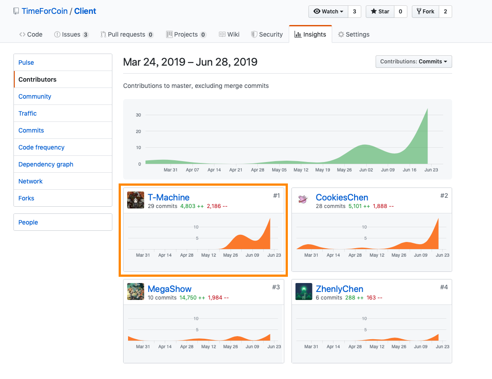

# 个人报告

16340032 陈统盼

GitHub：[T-Machine](https://github.com/T-Machine)

## 简短的课程学习自我总结

在此次项目中我负责Web端部分的工作，包括部分功能逻辑的实现以及部分UI的设计，并参与了Web端及小程序端的测试工作。通过此次项目，我在前端技术知识、项目设计、团队合作等方面均有较大的收获。

### 分析

参与了最初版本的需求分析，确定了部分用户需求。

### 设计

参与了Web端端UI设计，并在实际开发的过程中修改设计。

### 开发

实现了个人任务中心、任务详情、任务发布等页面。

参与Web端和小程序端测试。

## PSP 2.1

|                     | Personal Software Process Stages | Time(%) |
| ------------------- | -------------------------------- | ------- |
| **Inputs Required** |                                  | **5**   |
|                     | 估计时间                         | 5       |
| **Planning**        |                                  | **15**  |
|                     | 制定需求文档                     | 5       |
|                     | 制定开发计划                     | 7       |
|                     | 制定进度模板                     | 3       |
| **Development**     |                                  | **65**  |
|                     | 设计程序                         | 10      |
|                     | 审查设计                         | 5       |
|                     | 实施编码                         | 25      |
|                     | 审查代码                         | 15      |
|                     | 编译并测试程序                   | 10      |
| **Exit Criteria**   |                                  | **15**  |
|                     | 完成程序测试报告                 | 5       |
|                     | 完成项目计划总结                 | 5       |
|                     | 完成设计和代码审查清单           | 5       |

## 个人分支的 GIT 统计报告

### Web端

## 自认为最得意/或有价值/或有苦劳的工作清单

### 最得意

简洁的UI设计；利用Ant组件实现了图片及文件的上传和显示功能。

### 最有价值

实现了单个Vue页面在多个场景中的复用。

### 最有劳苦

优化页面UI布局，测试后端API。

## 个人的技术类、项目管理类博客清单

[关于Vue的生命周期](<https://blog.csdn.net/Drawspirit/article/details/93987180>)