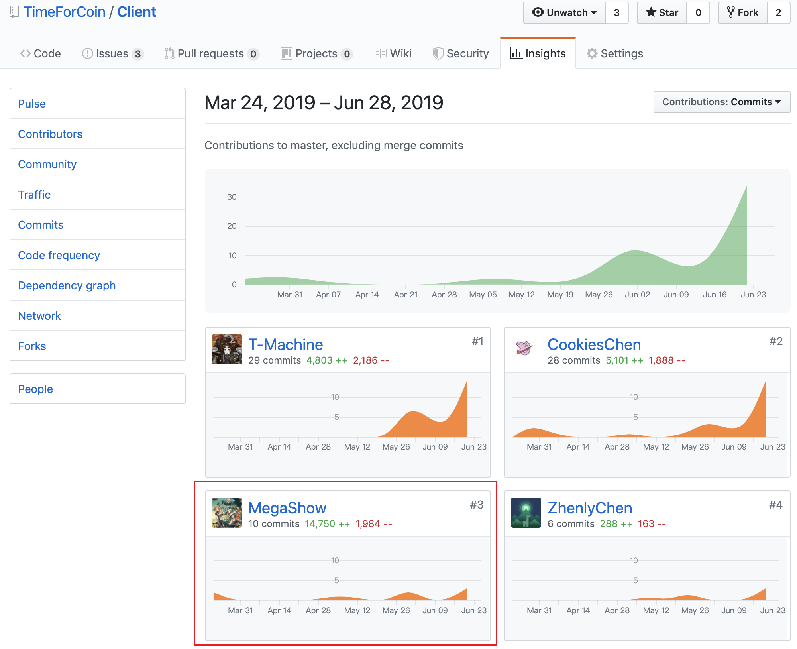

# 个人报告

GitHub：[MegaShow](https://github.com/MegaShow)

## 简短的课程学习自我总结

在本项目里面我主要负责项目管理、以及前端的部分工作。

在项目的前期，主要进行了需求分析与设计两方面的工作。需求分析上，与组内其它成员共同讨论并确定下项目的定位、需求，得到了项目最基本的需求分析文案。同时，我与Zhenly同学对Server、Client、MiniProgram等平台不同技术架构进行讨论，选择适合的相关技术栈，同时定下一些代码与设计规范。

在项目的中期，我负责为Web端进行各个模块的划分，并搭建了Web端的基础架构，引入相关的lint规范，约束和规范Web端的代码风格。同时，与CookiesChen共同完成Navbar、Backtop等通用组件的实现，同时负责实现Web端的部分路由跳转的逻辑。

在项目的后期，由于本人已外出实习，仅负责Web端部分代码lint的工作、部分请求的错误判断逻辑实现以及其余细节上的小改动。同时，负责前端开发进度管理以及部分接口及功能的测试。

最后特别感谢本团队的其他成员，他们在项目的各个部分都付出比较多的努力。尤其是在项目后期，本人外出实习，项目的进度不能及时跟进的情况下，他们依然能够在做好自己的工作的基础上整合、对接，将项目实现得更加完美。

## PSP 2.1

| | Personal Software Process Stages | Time(%) |
| :--: | :--: | :--: |
| **Inputs Required** | | **5** |
| | 估计时间 | 5 |
| **Planning** | | **18** |
| | 制定需求文档 | 10 |
| | 制定开发计划 | 5 |
| | 制定进度模板 | 3 |
| **Development** | | **60** |
| | 设计程序 | 15 |
| | 审查设计 | 10 |
| | 实施编码 | 15 |
| | 审查代码 | 10 |
| | 编译并测试程序 | 10 |
| **Exit Criteria** | | **17** |
| | 完成程序测试报告 | 4 |
| | 完成项目计划总结 | 5 |
| | 完成设计和代码审查清单 | 8|

## 个人分支的GIT统计报告

### 文档

### Web端

### 小程序端

## 自认为最得意/或有价值/或有苦劳的工作清单

第一次搭建单页面应用的架构，完成了Web端基本架构的搭建，以及相关lint的配置，使得各模块之间更加直观。
