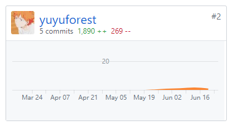

# 16340280 - yuyuforest - Final Report

## 个人小结

在本项目中，我主要负责后端的设计与开发，参与编写了部分API。

通过这次项目，我初次接触到了iris框架、MongoDB等，以及RESTful API的编写规范、如何使用Swagger辅助开发。

## 主要工作清单

- 任务相关接口
  - 获取任务列表
    - 分页获取
    - 按类型/状态/酬劳类型/用户类型筛选
    - 按关键词搜索
    - 按不同规则排序
- 问卷相关接口
  - 创建文件
  - 获取问卷基本信息
  - 修改问卷基本信息
  - 获取问卷问题信息
- 公告相关接口
  - 获取公告列表
  - 新建公告文章
  - 获取公告详情
  - 修改公告信息

## PSP2.1

| Personal Software Process Stages | Time(%)          |        |
| -------------------------------- | ---------------- | ------ |
| **Inputs Required**              |                  | **10** |
|                                  | 估计时间         | 10     |
| **Planning**                     |                  | **5**  |
|                                  | 需求分析         | 5      |
| **Development**                  |                  | **80** |
|                                  | 设计程序         | 5      |
|                                  | 实施编码         | 45     |
|                                  | 审查代码         | 15     |
|                                  | 编译并测试程序   | 15     |
| **Exit Criteria**                |                  | **5**  |
|                                  | 完成项目计划总结 | 5      |

## GitHub贡献

# 个人博客清单

[在Go语言下使用MongoDB](https://yuyuforest.com/2019/06/27/mongodb-in-go/)

