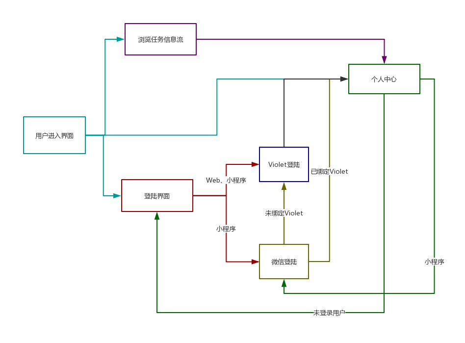

# Product Requirement 产品需求规格说明

| 版本 | 修订人      | 修订日期   | 概括 |
| ---- | ----------- | ---------- | --- |
| 1.0  | Cookieschen | 2019-04-10 | |
| 1.1  | chensh236 | 2019-04-12 | |
|  2.0 | chensh236|2019-04-13| |
|  2.1 | ZhenlyChen|2019-04-19| 完善登陆细节 |
## 一、前言

本文档的目的是详细地介绍「闲得一币」众包系统所包含的需求，以便查看者能够确认产品的确切需求以及开发人员能够根据需求设计编码。本文档的预期读者有开发人员，老师/助教，项目经理。

## 二、任务概述

### 目标

用户通过小程序或者网页可以发布或者接受任务，任务类型包括**跑腿**，**问卷**，**资料征集**，同时平台还包括**公告**的发布。			

* 小程序
  * 提供**当前发布任务**的情况，包括任务名称、类型、酬劳、发布者、发布时间、截止时间和要求。
  * 提供**已完成任务**的情况，包括任务名称、类型、酬劳、发布者、发布时间、截止时间和要求。此外如果是**问卷类**，需要为**发布者**提供问卷统计信息（条形图，扇形图等）。
* 网页
  * 相比于小程序，主要多了一个**问卷创建**的功能。

### 用户特点

* 任务发布者
  * 时间不充裕
  * 手头富足
  * 资料缺乏
  * 社会调查
* 任务接受者
  * 时间充裕

## 三、需求规定

### 1. 用户功能

#### 1.1 用户登录

本系统的登陆以Violet为主，小程序内使用微信登陆辅助实现快捷登陆

使用微信登陆的目的是降低产品的门槛，如果填写问卷的每一个人都需要注册账号之后才能填写的话，那么就有可能阻挡掉很大一部分的用户，因此引入微信快捷登陆，只需要点个同意就可以立即填写问卷。而绑定之后，在小程序上可以直接快捷登陆。

而由于网页端的微信登陆需要企业认证，因此使用Violet中央授权系统打通微信和PC端的账号体系。在两端都可以实现互相绑定，绑定Violet账户拥有正式用户权限，而微信登陆用户只有部分权限，便于绑定时账号信息的合并。同时促进用户对双端的绑定。

##### PC端

- 仅使用Violet中央授权系统登陆
- 登陆后可以生成特定的小程序码，通过扫码进行快捷绑定当前账号

##### 小程序

- 两种登陆方式：跳转到Violet授权登陆、微信登陆
- 微信登陆之后：
  - 绑定Violet，跳转Violet授权登陆
  - 暂不绑定，仅享有部分功能（如填写问卷），如需使用更多功能（点赞、评论、发布）则需要绑定Violet
- 用户中心可以进行Violet账号绑定

#### 1.2 小程序功能

小程序功能可以分为以下五大部分

- 大堂：主页，包括信息的展示、搜索、（扫码功能）。
- 发布：用户可以发布任务，包括跑腿类、（问卷类）、资料征集三大类型，以及公告的发布。
- 任务盒：公告消息、互动消息以及用户活动消息，用户发布以及接受的任务。
- 我的：用户可以查看和修改个人信息等设置。
- 搜索内容展示：展示用户搜索的任务以及用户信息。
- 用户信息展示：展示用户的信息，且可以添加关注。
- 任务信息展示：展示任务或公告信息。
- 评价
- 个人认证

#### 1.2.1 主页

主页的功能包括三大方面：

- 搜索
- （扫码）
- 消息展示

用户进入主页时，上方为搜索（以及扫码）功能，之下展示任务以及公告信息，并在信息展示区域的顶栏进行分类（推荐、跑腿、问卷、资料征集、**公告**（起个好点的名字，公告怪怪的）），用户通过左右滑动进行类别切换。在下面通过卡片的形式进行信息的展示，包括：

- 图片/小视频
- 标题
- 酬劳（闲钱闲币需要很明显区分）
- 截止时间（公告没有）
- 发布者信息（id、头像、信用度）
- 是否置顶（/会员）标签
- （插入广告卡片？）

在右下方添加`floatbutton`，如果信息展示区域没有滑动到顶部，则进行显示，用户点击返回展示区域的顶部。

在底部，用户可以进行小程序功能的选择，即主页、发布、任务盒、我的。

#### 1.2.11 搜索

在用户未点击搜索功能区域时，搜索栏显示推荐的内容（广告？会员置顶？...）。

在用户点击搜索区域后，搜索功能包括以下几个部分：

- 类别：区分用户搜索内容为任务或是用户。
- 清除：清除用户输入的内容。
- 取消：用户取消搜索，返回主页。
- 提示：提示用户输入的关键词。
- 搜索：进行任务或者用户的搜索。
- 搜索历史：用户搜索过的关键词，以标签形式显示。
- 大家都在搜：较多用户搜索的关键词。
- 搜索历史删除：点击清除搜索历史。

在用户点击搜索时，采用**模糊搜索**的的策略，且显示提示词，比如用户输入“了”，在下方提示“了不起的盖茨比”等提示。用户点击搜索按键进行搜索，点击清除按钮清除搜索栏中的内容，点击取消返回主页。

#### 1.3 发布

发布页面包括如下部分：

- 分类（跑腿、问卷、资料征集、公告）
- 标题
- 详细内容
- 图片（点击添加）
- 地点
- 价格
- 确认发布按钮

用户必须选择类别，必须添加标题与内容，必须添加价格，必须添加地点。用户可以选择加入图片与否，多张图片中用户可以选择主图并进行首页卡片的显示。在点击发布按钮后发布，否则可以取消并返回主页。

其中的分类不包括问卷选项，问卷只在网页端发布。

#### 1.4 任务盒

在顶部添加公告消息、互动消息以及活动信息三大部分。

- 通知消息：网站管理员的公告信息，比如版本更新，停服，封号等。
- 互动信息：用户关注用户的发布内容。
- 活动信息：用户发布信息、用户接受任务、用户积分变更。

在下方为任务盒，分为三类：发布的任务、接受的任务和收藏，下方为任务列表，内容包括：

- 任务标题
- 任务内容的前10/20个字符，以“...”结尾
- 任务相关图片（如果有）
- 任务状态（已发布，已接单，已完成），收藏列表没有。

用户点击列表中的项目进入对应任务/公告的详情页，任务按照已接单在前，已完成在后排序。

（用户长按删除任务，删除时弹出提示框）

在右下方添加`floatbutton`，如果信息展示区域没有滑动到顶部，则进行显示，用户点击返回展示区域的顶部。

#### 1.5 我的

该页面进行用户信息的查看以及设置。内容包括：

- 用户名显示
- 用户累计获得积分显示（添加“炫耀功能”生成图片）
- 关注/粉丝数量/收藏数量显示，点击进入对应列表
- 设置

#### 1.5.1 收藏列表

该列表显示用户收藏的任务，与任务盒列表一致。

#### 1.5.2 用户列表

用户列表包括如下部分：

- 用户名
- 用户头像
- 用户性别
- 用户粉丝数
- 是否关注（关注显示已关注，点击取消关注；否则显示未关注，点击关注）

用户点击列表中的项后进入用户页面。

### 1.5.3 设置

设置内容如下：

- 个人设置
  - 头像
  - 用户名
  - 性别
  - 生日（从而获得星座，在个人主页显示）
  - 常住地（校区？）
  - 个人认证
- 反馈
- 版本信息
- （清除缓存）
- 退出登录

### 1.6 搜索内容显示

搜索内容显示页上部分依旧为搜索区域，功能与主页搜索区域一致，但添加返回键，点击返回主页。

下方为任务显示区域，顶部可以选择排序方式以及筛选。

排序方式：

- 默认排序
- 闲币从低到高
- 闲币从高到低
- 最新发布
- 最多人看

筛选：

- 任务类型
- 发布时间
- 闲币价格
- 信用等级

下方卡片显示形式与主页一致。

### 1.7 用户信息显示

用户信息显示页顶部显示用户信息：

- 头像
- 用户名
- 性别····
- 最后登录时间
- 是否已经个人认证
- 关注按钮
- 信用等级
- 关注
- 粉丝数
- 评价

在下方进行任务/公告列表显示，与主页列表一致，但删除个人相关信息，只显示图片、任务名与价格。

### 1.8 任务信息显示

任务信息显示页面包括：

- 顶部
  - 用户头像
  - 用户名
  - 用户信用信息
  - 用户性别
  - 用户最后登录时间
  - 用户发布地点
- 下方
  - 任务价格
  - 任务类别
  - 任务详情内容
  - 图片
- 底部
- 赞
- 我想要

用户点击我想要后，弹出发布者用户的微信信息。

### 1.9 评价页面

### 1.1 基本功能

* 进入小程序/网页
* 登录/注册
  * 跳转violet 3.0

**任务接受者**：

* 在展示栏查看**当前发布任务**
* 查看**当前发布任务**详情
  * 查看名称、类型、酬劳、发布者、发布时间、截止时间和要求确定是否接受任务。
* 接受任务
* 完成任务，由**任务发布者**确定
  * 获取酬劳

**任务发布者**：

* 可查看自己发布的**问卷类任务**的统计信息。

* 进入任务创建页面创建任务
  * 跑腿**，**问卷**，**资料征集**，**公告等，编辑任务基本信息，名称、类型、酬劳、发布者、发布时间、截止时间。
  * 问卷类，编辑任务基本信息，名称、类型、酬劳、发布者、发布时间、截止时间。
    * 进入问卷创建页面，创建问卷、预览问卷
* 确认任务
* 支付系统
  * 微信支付
  * 支付宝支付
  * 闲钱币支付
* 确认任务完成（截止日期过后2天若未确认，则默认已完成）

#### 1.2 次要功能

**任务接受者**：

* 放弃任务

**任务发布者**：

* 撤回已发布任务
  * 跑腿**，**问卷**，**资料征集**，**公告等直接返还已支付的金额。
  * 问卷类，不返还已填写问卷部分。

**任务推荐**

* 根据发布时间，发布者的信誉（发布者发布任务并且成功完成次数）和任务加急进行**加权推荐**。

