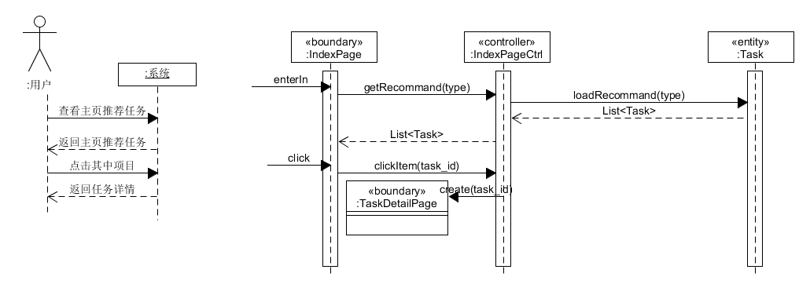
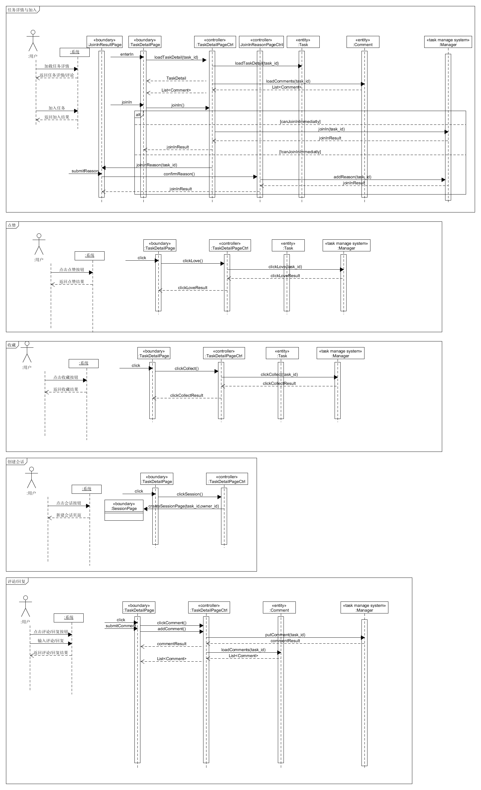
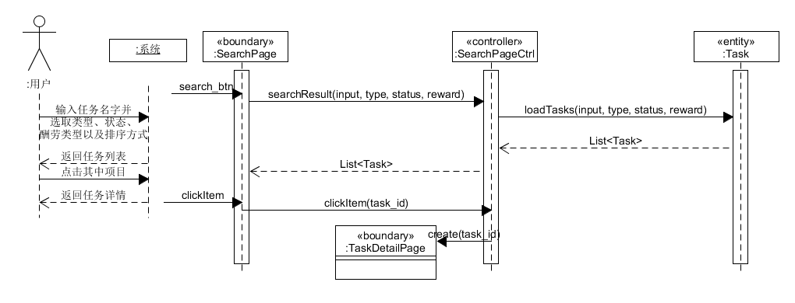
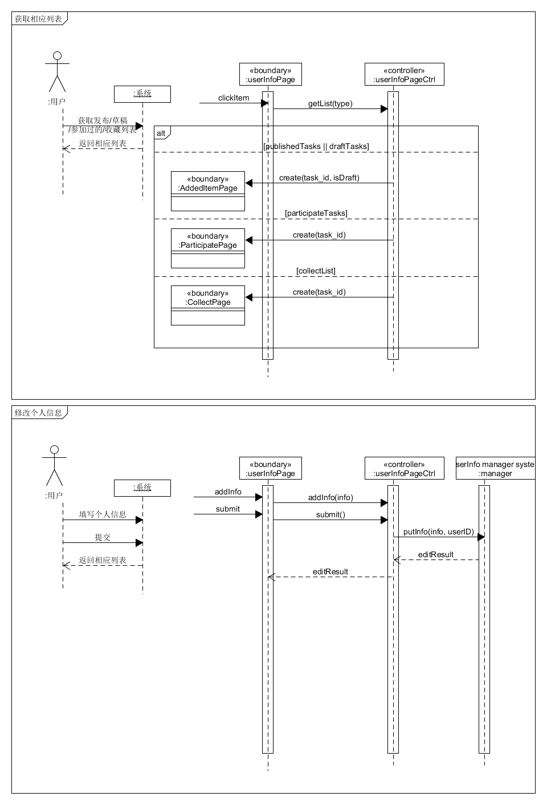

# 基本功能

| 版本 |时间| 内容 | 贡献者 |
| ----| ---- | ---- | ------ |
| 1.0 | 2019-6-27 | SSD图 | chensh236 |

- 主页获取推荐任务
- 查看任务详情
  - 任务点赞
  - 任务收藏
  - 任务评论
  - 加入任务
- 消息管理
  - 获取消息列表
  - 获取会话列表
  - 新建会话
- 任务搜索
- 用户信息管理
  - 获取相对应列表
  - 用户信息修改

## 主页获取推荐任务

在主页中，用户根据不同的类型（所有、跑腿、信息、问卷）获取推荐列表。点击列表项目进入详情页。

## 查看任务详情

- 根据用户点击时的任务id，可以获取对应的任务详情以及评论。
- 用户可以选择加入任务。如果任务为`立即加入`，直接加入即可，如果为`申请加入`，需要跳转申请页填写申请理由并提供发布者审核。
- 用户可以点击收藏按钮 以及 点赞按钮，收藏或者点赞任务
- 用户可以点击会话按钮，进入对应的会话页面新建或者获取对应的会话列表。

## 消息管理

- 用户进入消息管理页面，加载消息。消息分为两类：系统消息与个人消息。个人消息可以回复而系统消息不可以回复。
- 用户点击消息项，进入对应消息的会话页面。根据消息的id获取对应的会话列表。如果是个人消息可以新建新的消息。

## 任务搜索

- 根据用户的输入以及筛选（类型筛选以及排序方式），获取对应的任务列表。用户点击任务列表中的项目可以进入任务详情页。

## 用户信息管理

- 在该页面中用户可以获取对应的任务列表（发布的任务列表、草稿列表、参加过的任务列表、收藏列表）。
- 该界面中用户还可以进行个人信息的修改。

