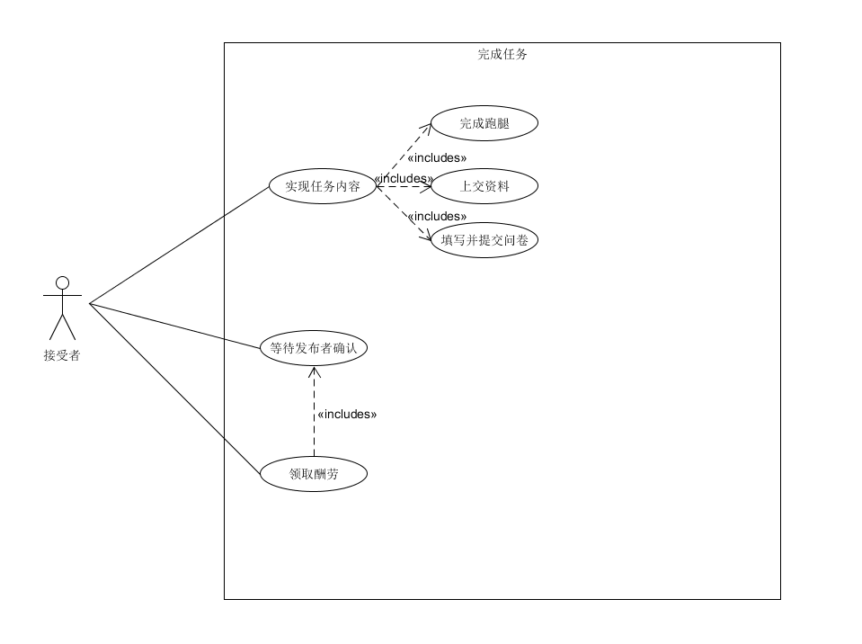
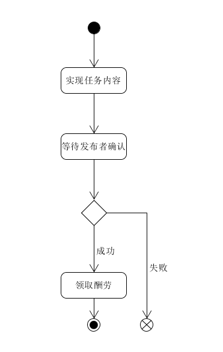

| 版本 | 日期       | 描述     | 作者        |
| ---- | ---------- | -------- | ----------- |
| 1.0  | 2018.06.26 | 完成任务 | CookiesChen |

**用例图**

**基本用例：**

- 实现任务内容：
  - 任务分为三种，需要分别完成对应的需求，分别是跑腿，上交征集的资料以及填写的问卷。
- 等待发布者确认：接受者是否完成任务由发布者进行确认（若发布者超过一定时间未确认则默认任务完成）
- 领取酬劳

**可选用例：**

- 查看任务详情：
  - 查看任务热度：通过查看浏览数，点赞数和收藏数接受者可以判断任务的性价比。

问卷类任务发布

**用例范围：**

web网页和微信小程序

**用例级别：**

用户目标

**主要参与者：**

接受者

**发生频率：**

经常

**安全性：**

若酬劳为实物，需要线下交易，需要提供机制保证接受者得到酬劳。

**流程图：**

