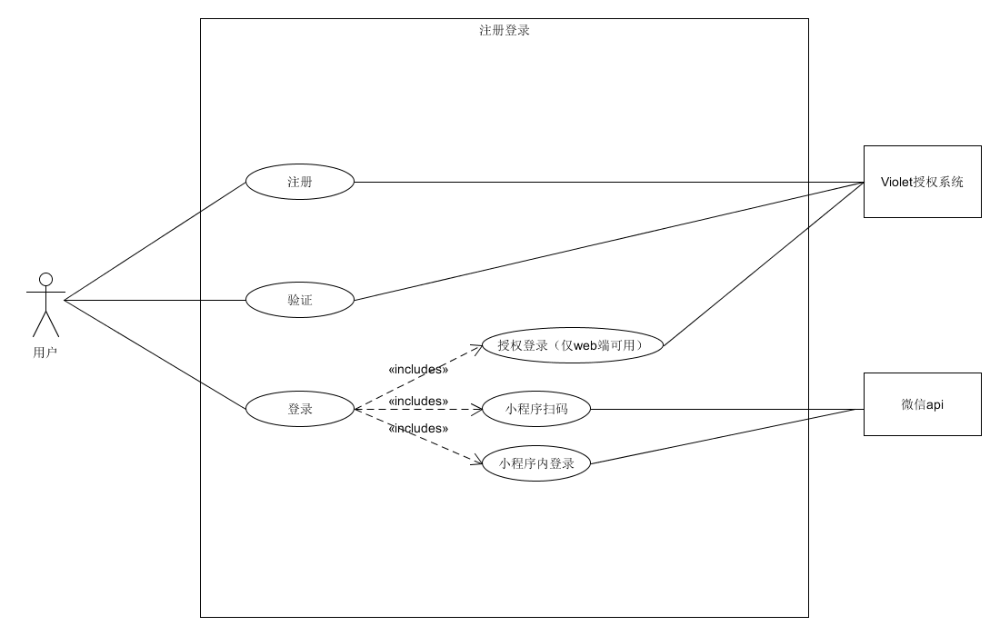
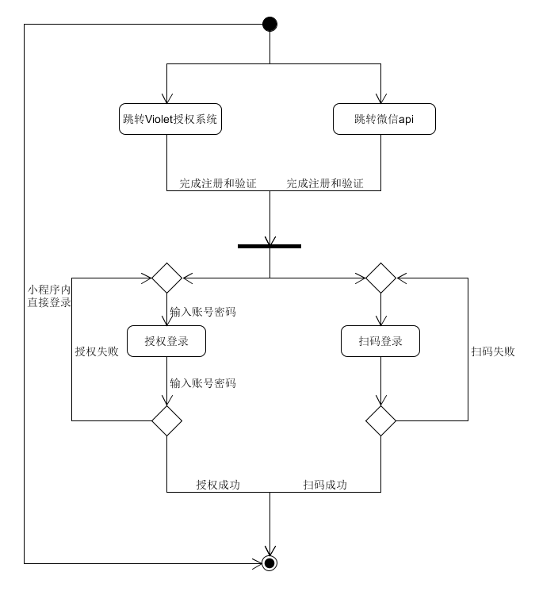

| 版本 | 日期       | 描述     | 作者        |
| ---- | ---------- | -------- | ----------- |
| 1.0  | 2019.06.26 | 注册登录 | CookiesChen |
| 1.1  | 2019.06.27 | 注册登录 | chensh236 |
**用例图**

**基本用例：**

- 注册和验证：跳转Violet授权系统（仅web端可用）或微信注册验证获取账号
- 登录：
  - 跳转Violet授权系统（仅web端可用）
  - 使用微信小程序扫码登录
  - 在微信小程序中直接登录

**用例名称：**

用户注册与登录

**用例范围：**

web网页和微信小程序

**用例级别：**

用户目标

**主要参与者：**

用户

**发生频率：**

经常

**流程图：**

