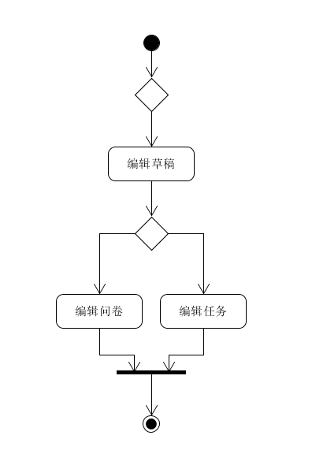

| 版本 | 日期       | 描述     | 作者        |
| ---- | ---------- | -------- | ----------- |
| 1.0  | 2018.06.26 | 管理任务 | CookiesChen |

**用例图**

**基本用例：**

- 接受者：
  - 放弃任务
- 发布者：
  - 审批接受者：接受者申请领取任务后，发布者可以接受或者拒绝其参与。
  - 查看任务进度：接受者完成任务后，由发布者进行确认，若发布者超过一定时间未确认则默认任务完成，如果任务是问卷类型，发布者可以查看当前问卷的统计数据。
  - 关闭任务：发布者终止任务，接受者无法继续申请领取任务。
  - 编辑草稿：任务草稿方便发布者修改任务信息，如果是问卷类型，则可以多次修改编辑问卷。

**可选用例：**

- 查看任务详情：
  - 查看任务热度：通过查看浏览数，点赞数和收藏数接受者可以判断任务的性价比。

问卷类任务发布

**用例范围：**

web网页和微信小程序

**用例级别：**

用户目标

**主要参与者：**

接受者

**发生频率：**

偶尔

**流程图：**

