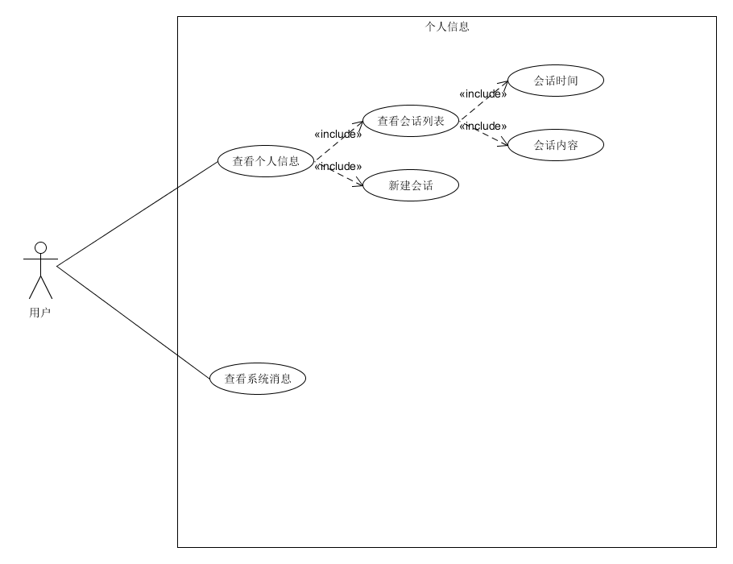
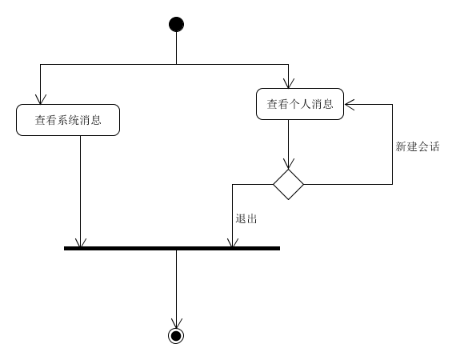

| 版本 | 日期       | 描述     | 作者      |
| ---- | ---------- | -------- | --------- |
| 1.0  | 2019.06.27 | 消息管理 | chensh236 |
**用例图**

**基本用例：**

- 查看个人消息
  - 查看会话列表
    - 会话时间
    - 会话内容
  - 新建会话

- 查看系统消息

**用例范围：**

微信小程序

**用例级别：**

用户目标

**主要参与者：**

平台用户

**发生频率：**

偶尔

**流程图：**

