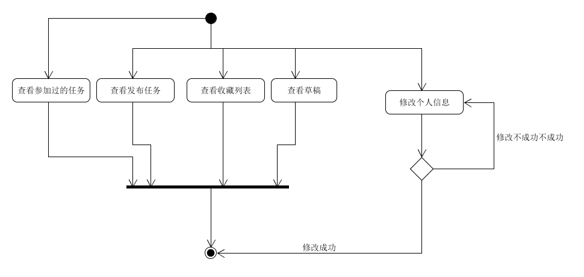

| 版本 | 日期       | 描述         | 作者      |
| ---- | ---------- | ------------ | --------- |
| 1.0  | 2019.06.27 | 个人信息管理 | chensh236 |
**用例图**

**基本用例：**

- 查看已发布的任务
- 查看保存的草稿
- 查看参加过的任务
- 查看收藏列表
- 个人信息修改
  - 昵称
  - 性别
  - 可选：个人简介
  - 邮箱
  - 手机号码
  - 学校
  - 地址

**用例范围：**

web网页和微信小程序

**用例级别：**

用户目标

**主要参与者：**

平台用户

**发生频率：**

经常

**流程图：**

