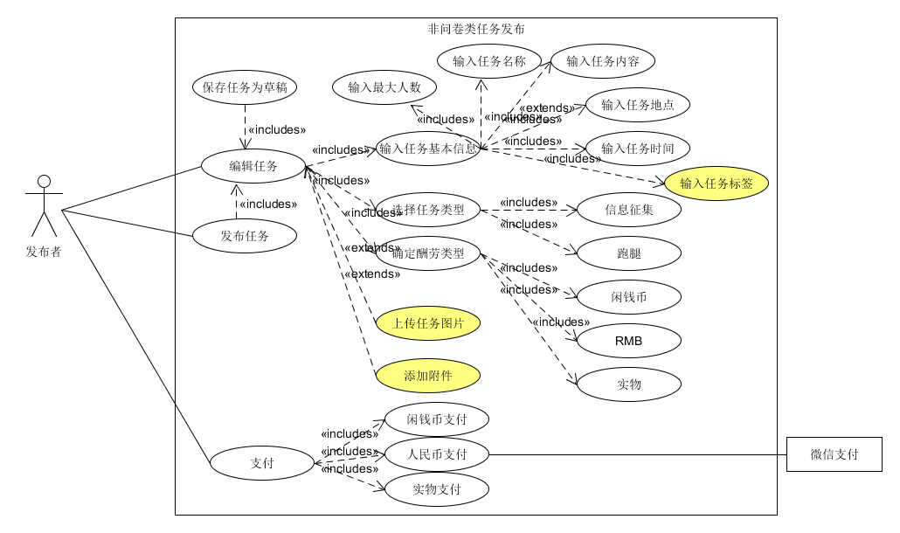
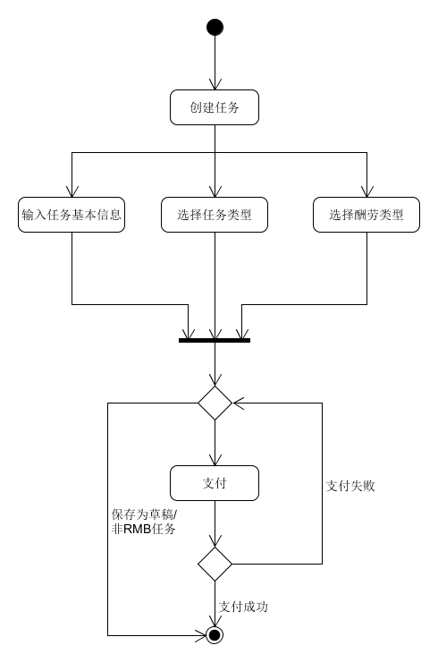
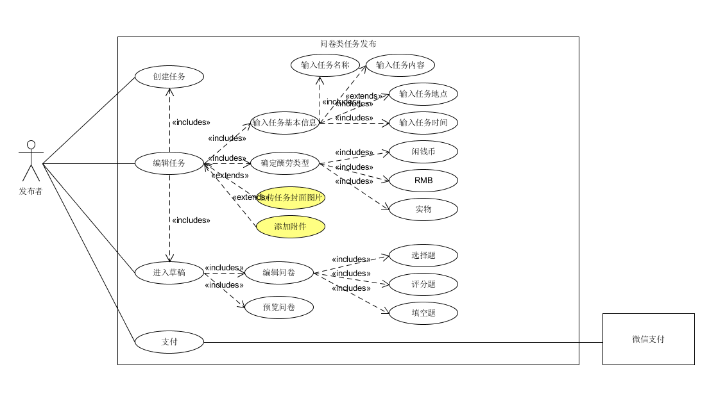
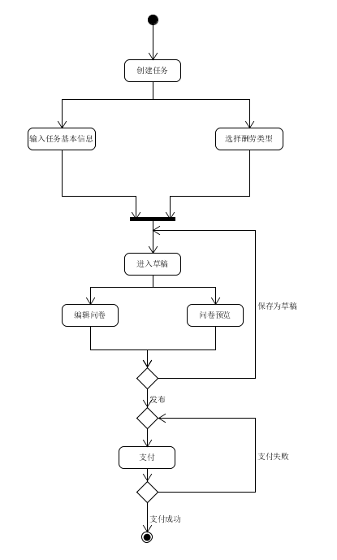

| 版本 | 日期       | 描述     | 作者        |
| ---- | ---------- | -------- | ----------- |
| 1.0  | 2019.06.26 | 发布任务 | CookiesChen |
| 2.0  | 2019.06.27 | 发布任务 | chensh236 |
**1. 发布非问卷类任务**

**用例图**

**基本用例：**

- 发布任务
- 保存任务为草稿
- 编辑任务信息：
  - 输入基本信息：用户需要输入任务的名称、内容、任务地点以及任务的有效时间段以及最大人数
  - 可以选择输入用户标签
  - 选择任务类型：非问卷类任务包括两种，信息征集以及跑腿
  - 选择酬劳类型：酬劳可分为三种，闲钱币、RMB和实物（线下进行）
- 支付：
  - 闲钱币支付
  - 跳转微信支付（待定，还未企业认证）
  - 实物支付

**可选用例：**

- 编辑任务信息：
  - 上传任务图片：上传图片用于展示
  - 添加附件：添加完成任务必须的附件（照片，试题等）

**用例名称：**

非问卷类任务发布

**用例范围：**

web网页和微信小程序

**用例级别：**

用户目标

**主要参与者：**

发布者

**发生频率：**

经常

**流程图：**

**2、发布问卷类任务**

**用例图**

**基本用例：**

- 创建任务
- 编辑任务信息：
  - 输入基本信息：用户需要输入任务的名称、内容、任务地点以及任务的有效时间段
  - 选择酬劳类型：酬劳可分为三种，闲钱币、RMB和实物（线下进行）
- 进入草稿：问卷类首先会被保存为草稿，方便发布者多次编辑问卷以及基本信息
  - 编辑问卷：目前支持选择题，评分题和填空题
  - 预览问卷：发布者可以预览问卷发布之后的样式
- 支付：跳转微信支付（待定，还未企业认证）

**可选用例：**

- 编辑任务信息：
  - 上传任务封面图片：上传封面图片用于展示
  - 添加附件：添加完成任务必须的附件（照片，试题等）

**用例名称：**

问卷类任务发布

**用例范围：**

web网页

**用例级别：**

用户目标

**主要参与者：**

发布者

**发生频率：**

偶尔

**流程图：**

