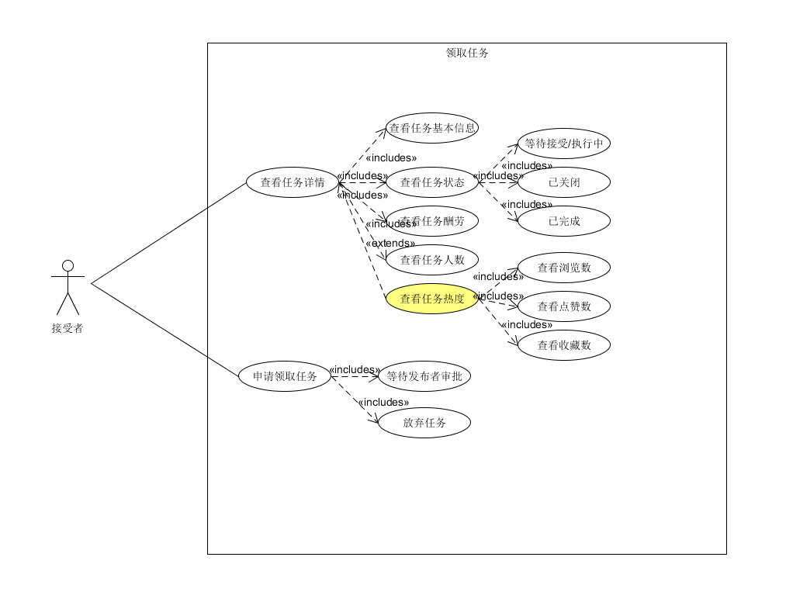
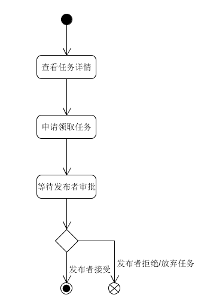

| 版本 | 日期       | 描述     | 作者        |
| ---- | ---------- | -------- | ----------- |
| 1.0  | 2018.06.26 | 领取任务 | CookiesChen |

**用例图**

**基本用例：**

- 查看任务详情：接受者在领取任务之前可以先查看任务的详情
  - 查看任务基本信息
  - 查看任务状态：任务状态分为三种，只有任务在等待接受/执行中时才能申请领取任务。
  - 查看任务酬劳
  - 查看任务人数：任务人数未达到上限时可申请领取任务。
- 申请领取任务详情：申请领取任务之后，需要等待发布者审批（发布者可设置为无需审批）

**可选用例：**

- 查看任务详情：
  - 查看任务热度：通过查看浏览数，点赞数和收藏数接受者可以判断任务的性价比。

问卷类任务发布

**用例范围：**

web网页和微信小程序

**用例级别：**

用户目标

**主要参与者：**

接受者

**发生频率：**

经常

**流程图：**

