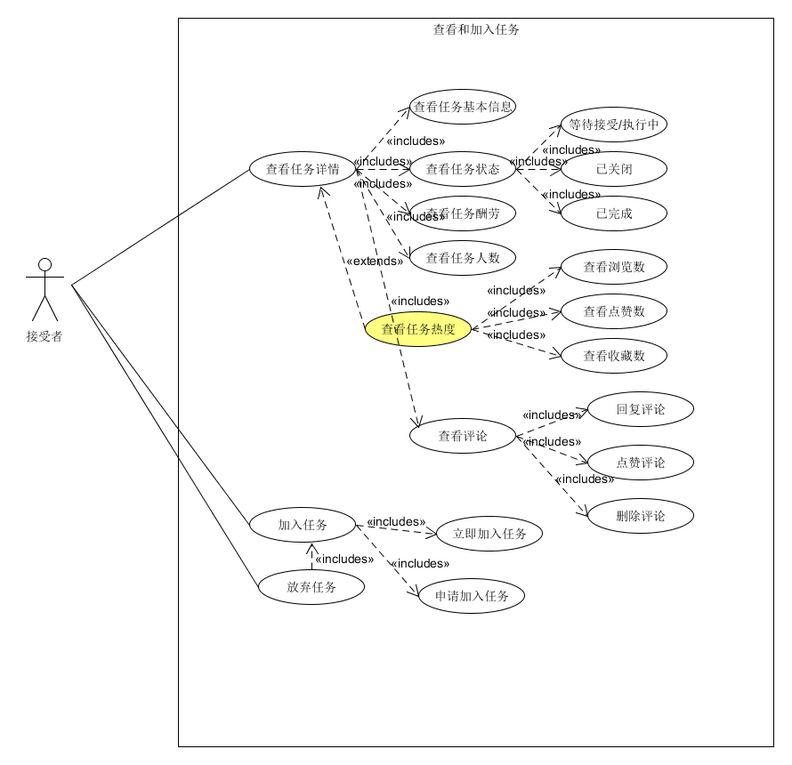
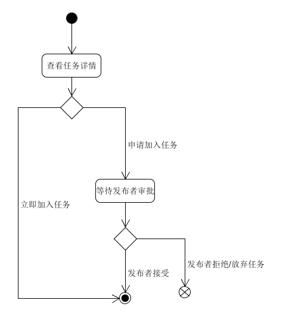

| 版本 | 日期       | 描述     | 作者        |
| ---- | ---------- | -------- | ----------- |
| 1.0  | 2019.06.26 | 领取任务 | CookiesChen |
| 2.0  | 2019.06.27 | 领取任务 | chensh236 |
**用例图**

**基本用例：**

- 查看任务详情：接受者在领取任务之前可以先查看任务的详情
  - 查看任务基本信息：即标题、内容、图片、任务开始以及完成时间等。
  - 查看任务状态：任务状态分为三种，只有任务在等待接受/执行中时才能申请领取任务。
  - 查看任务酬劳：分为闲币、人民币、实物三种。
  - 查看任务人数：即任务可以接受的总人数和当前已经加入的人数。
  - 查看评论：查看评论后可以选择回复、点赞评论；用户可以删除自己的评论。
- 加入任务
  - 立即加入任务：无需任务发布者审批即可立即加入
  - 申请加入任务：需填写申请理由并供发布者审批，审批后可加入
- 如果已经加入了任务，可以选择放弃任务

**可选用例：**

- 查看任务详情：
  - 查看任务热度：通过查看浏览数，点赞数和收藏数接受者可以判断任务的性价比。

问卷类任务发布

**用例范围：**

web网页和微信小程序

**用例级别：**

用户目标

**主要参与者：**

任务接受者

**发生频率：**

经常

**流程图：**

