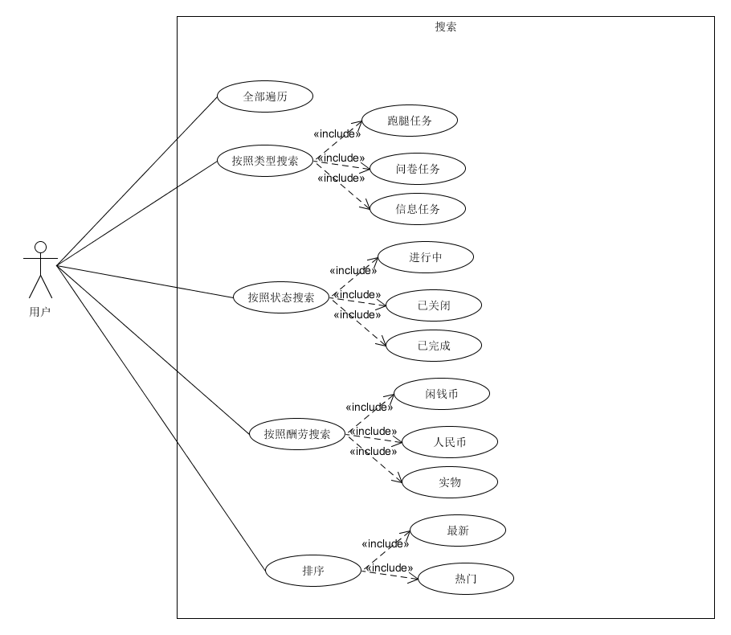
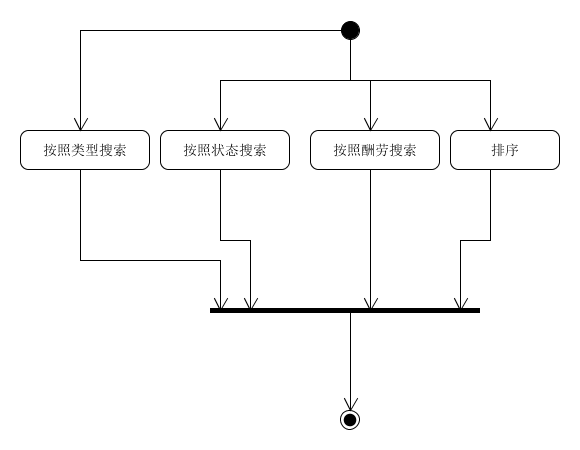

| 版本 | 日期       | 描述 | 作者      |
| ---- | ---------- | ---- | --------- |
| 1.0  | 2019.06.27 | 搜索 | chensh236 |
**用例图**

**基本用例：**

- 按照类型搜索
  - 跑腿任务
  - 信息任务
  - 问卷任务
- 按照状态搜索
  - 进行中
  - 已关闭
  - 已完成
- 按照酬劳搜索
  - 闲钱币
  - 人民币
  - 实物
- 排序
  - 最新
  - 热门

**用例名称：**

搜索

**用例范围：**

微信小程序

**用例级别：**

用户目标

**主要参与者：**

用户

**发生频率：**

经常

**流程图：**

